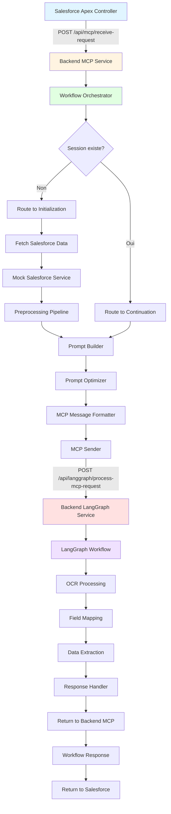
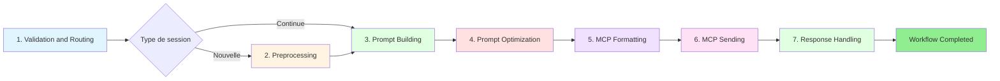
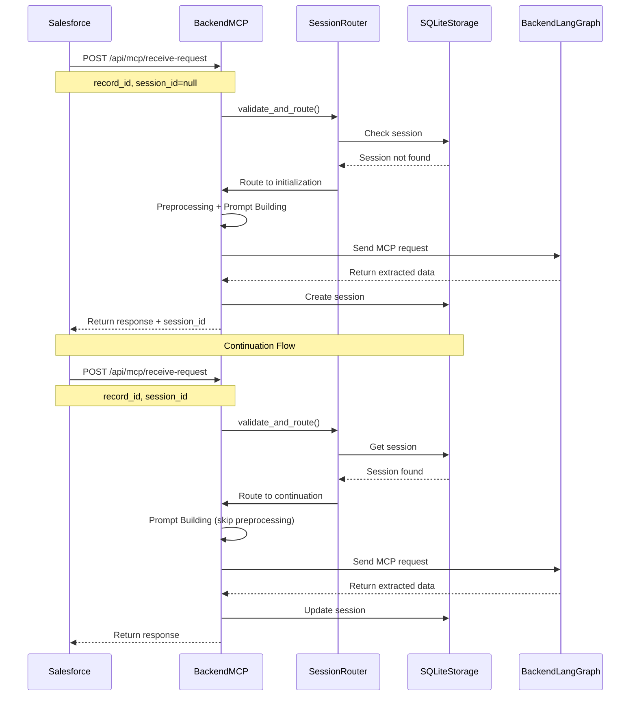

# OptiClaims - Backend Application

Application backend pour le traitement intelligent de sinistres avec intégration Salesforce et agent GenAI LangGraph.

## Architecture

Le projet est organisé en microservices :

- **backend-mcp** : Service MCP (endpoints d'interaction avec Salesforce, orchestration du workflow)
- **backend-langgraph** : Service LangGraph (agent GenAI pour extraction de données depuis documents)
- **mock-salesforce** : Service mock pour simuler les interactions Salesforce
- **test-data** : Données et scripts de test pour validation end-to-end

## Structure du Projet

```
sfd-clm/
├── backend-mcp/          # Service MCP (orchestration workflow)
│   ├── app/
│   │   ├── api/         # Endpoints FastAPI
│   │   ├── core/         # Configuration et logging
│   │   ├── services/    # Services métier (workflow, preprocessing, etc.)
│   │   └── models/      # Schémas Pydantic
│   └── requirements.txt
├── backend-langgraph/    # Service LangGraph (agent GenAI)
│   ├── app/
│   │   ├── api/         # Endpoints FastAPI
│   │   ├── graph.py      # Définition du graphe LangGraph
│   │   ├── nodes/        # Nœuds du workflow (OCR, mapping, etc.)
│   │   └── orchestrator/ # Superviseur du workflow
│   └── requirements.txt
├── mock-salesforce/      # Service mock Salesforce
│   ├── app/
│   │   ├── api/         # Endpoints mock
│   │   └── data/        # Données mock
│   └── requirements.txt
├── test-data/           # Données et scripts de test
│   ├── documents/       # Documents PDF de test
│   ├── fields/          # Définition des champs Salesforce
│   └── test_pipeline.py # Script de test end-to-end
├── setup_venv.sh        # Script d'installation (Linux/Mac)
├── setup_venv.ps1       # Script d'installation (Windows)
├── verify_setup.sh      # Script de vérification (Linux/Mac)
└── verify_setup.ps1     # Script de vérification (Windows)
```

## Architecture du Pipeline

### Flux Principal End-to-End



### Workflow Orchestrator - Étapes Détaillées



### Flux de Session Management



## Installation

### Prérequis

- **Python 3.11+** : [Télécharger Python](https://www.python.org/downloads/)
- **SQLite** : Inclus dans Python (aucune installation requise)
- **pip** : Inclus avec Python

### Installation Automatique (Recommandé)

#### Linux / Mac

```bash
# Rendre le script exécutable
chmod +x setup_venv.sh

# Exécuter le script
./setup_venv.sh
```

#### Windows (PowerShell)

```powershell
# Exécuter le script
.\setup_venv.ps1
```

Les scripts vont :
1. Vérifier que Python 3.11+ est installé
2. Créer un environnement virtuel (`venv`) pour chaque service
3. Installer toutes les dépendances depuis `requirements.txt`
4. Préparer le répertoire SQLite pour le stockage de session

### Installation Manuelle

Si vous préférez installer manuellement :

#### 1. Backend MCP

```bash
cd backend-mcp
python3 -m venv venv
source venv/bin/activate  # Linux/Mac
# ou
venv\Scripts\activate  # Windows
pip install -r requirements.txt
```

#### 2. Backend LangGraph

```bash
cd backend-langgraph
python3 -m venv venv
source venv/bin/activate  # Linux/Mac
# ou
venv\Scripts\activate  # Windows
pip install -r requirements.txt
```

#### 3. Mock Salesforce

```bash
cd mock-salesforce
python3 -m venv venv
source venv/bin/activate  # Linux/Mac
# ou
venv\Scripts\activate  # Windows
pip install -r requirements.txt
```

### Vérification de l'Installation

Après l'installation, vérifiez que tout est correct :

#### Linux / Mac

```bash
chmod +x verify_setup.sh
./verify_setup.sh
```

#### Windows

```powershell
.\verify_setup.ps1
```

## Configuration

### Variables d'Environnement

Créez des fichiers `.env` dans chaque service si nécessaire :

#### backend-mcp/.env

```env
LOG_LEVEL=INFO
LOG_FORMAT=console  # ou "json" pour logs structurés
MOCK_SALESFORCE_URL=http://localhost:8001
SESSION_DB_PATH=data/sessions.db
SESSION_TTL_SECONDS=86400
LANGGRAPH_URL=http://localhost:8002
LANGGRAPH_TIMEOUT=30.0
```

#### backend-langgraph/.env

```env
LOG_LEVEL=INFO
LOG_FORMAT=console
# Ajoutez vos clés API si nécessaire
# OPENAI_API_KEY=your_key_here
# ANTHROPIC_API_KEY=your_key_here
```

### Session Storage

Le stockage de session utilise SQLite, qui est inclus dans Python. Aucune installation ou démarrage supplémentaire n'est requis. Le répertoire `data/` sera créé automatiquement au premier démarrage.

## Démarrage des Services

### Démarrage Manuel

#### 1. Mock Salesforce (Port 8001)

```bash
cd mock-salesforce
source venv/bin/activate  # Linux/Mac
# ou
venv\Scripts\activate  # Windows
uvicorn app.main:app --reload --port 8001
```

#### 2. Backend MCP (Port 8000)

```bash
cd backend-mcp
source venv/bin/activate  # Linux/Mac
# ou
venv\Scripts\activate  # Windows
uvicorn app.main:app --reload --port 8000
```

#### 3. Backend LangGraph (Port 8002)

```bash
cd backend-langgraph
source venv/bin/activate  # Linux/Mac
# ou
venv\Scripts\activate  # Windows
uvicorn app.main:app --reload --port 8002
```

### Démarrage Automatique (Test)

Utilisez les scripts dans `test-data/` :

#### Linux / Mac

```bash
cd test-data
chmod +x start_services.sh
./start_services.sh
```

#### Windows

```powershell
cd test-data
.\start_services.ps1
```

## Endpoints

### Mock Salesforce (Port 8001)

- `POST /mock/salesforce/get-record-data` : Récupère les données mock pour un record_id
- `POST /mock/apex/send-user-request` : Simulation requête Apex
- `GET /health` : Health check

### Backend MCP (Port 8000)

- `POST /api/mcp/receive-request` : Endpoint principal recevant les requêtes Salesforce
  - **Input** : `{"record_id": "string", "session_id": "string|null", "user_message": "string"}`
  - **Output** : Résultat complet du workflow avec données extraites
- `POST /api/mcp/request-salesforce-data` : Endpoint interne pour récupérer les données Salesforce
- `GET /api/task-status/{task_id}` : Statut des tâches async
- `GET /health` : Health check

### Backend LangGraph (Port 8002)

- `POST /api/langgraph/process-mcp-request` : Traite une requête MCP avec LangGraph
- `GET /health` : Health check

## Testing

### Test End-to-End avec test-data

Le dossier `test-data/` contient tout ce qu'il faut pour tester le pipeline complet.

#### Préparation

1. **Ajouter des documents PDF** dans `test-data/documents/`
2. **Vérifier le fichier de champs** `test-data/fields/fields.json`

#### Exécution du Test

##### Linux / Mac

```bash
cd test-data
chmod +x run_pipeline_test.sh
./run_pipeline_test.sh
```

##### Windows

```powershell
cd test-data
.\run_pipeline_test.ps1
```

Le script va :
1. Démarrer tous les services nécessaires
2. Vérifier que les services sont prêts
3. Lire les documents et champs de test
4. Exécuter le pipeline complet
5. Afficher les résultats

### Tests Unitaires

```bash
# Depuis la racine du projet
pytest tests/
```

## Logging

Le système de logging supporte deux formats :

### Format Console (Par défaut)

Logs lisibles avec couleurs et indicateurs de progression :

```
2024-01-15 10:30:45 INFO     [14%] Step 1/7: validation_routing - Starting Validation & Routing (record_id=001XX000001)
2024-01-15 10:30:45 INFO     Step 1 completed: Validation & Routing (took 0.12s)
```

### Format JSON

Pour les logs structurés (utile pour l'agrégation) :

```bash
export LOG_FORMAT=json
```

Les logs incluent :
- **Progression** : Pourcentage et étape actuelle
- **Timing** : Temps d'exécution par étape
- **Contexte** : record_id, session_id, workflow_id

## Documentation Complète

- **[Documentation du Pipeline](docs/PIPELINE_DOCUMENTATION.md)** : Documentation exhaustive avec diagrammes, formats de données, et scénarios de test
- **[Exemples de Test](docs/TEST_EXAMPLES.md)** : Exemples concrets et scripts prêts à l'emploi

## Dépannage

### Problèmes Courants

#### Les services ne démarrent pas

1. Vérifiez que les venv sont créés : `./verify_setup.sh` ou `.\verify_setup.ps1`
2. Vérifiez que les ports sont libres (8000, 8001, 8002)
3. Vérifiez les logs dans la console

#### Erreur de base de données SQLite

1. Vérifiez que le répertoire `backend-mcp/data/` existe et est accessible en écriture
2. Vérifiez le chemin de la base de données dans la configuration (`SESSION_DB_PATH`)
3. Le répertoire `data/` sera créé automatiquement si nécessaire

#### Erreurs d'import Python

1. Assurez-vous d'avoir activé le venv : `source venv/bin/activate`
2. Vérifiez que les requirements sont installés : `pip list`
3. Réinstallez si nécessaire : `pip install -r requirements.txt --force-reinstall`

## Contribution

Pour contribuer au projet :

1. Créez une branche depuis `main`
2. Faites vos modifications
3. Testez avec `test-data/test_pipeline.py`
4. Vérifiez les logs et la structure de réponse
5. Créez une pull request

## Licence

[À définir]
