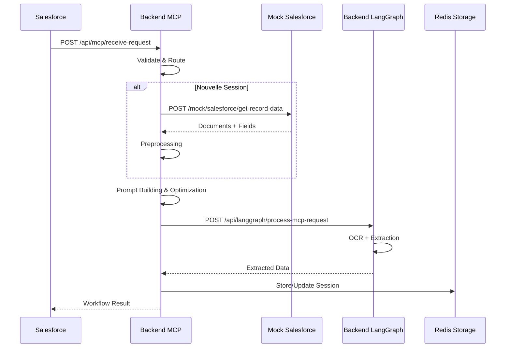

# Référence API Complète - OptiClaims

Documentation complète et à jour de toutes les APIs du pipeline OptiClaims avec spécifications détaillées input/output.

## Table des Matières

1. [Vue d'Ensemble](#vue-densemble)
2. [Mock Salesforce Service](#mock-salesforce-service)
3. [Backend MCP Service](#backend-mcp-service)
4. [Backend LangGraph Service](#backend-langgraph-service)
5. [Codes d'Erreur](#codes-derreur)
6. [Formats de Données](#formats-de-données)

## Vue d'Ensemble

Le pipeline OptiClaims est composé de 3 services principaux :

| Service | Port | Description |
|---------|------|-------------|
| Mock Salesforce | 8001 | Service de simulation Salesforce pour les tests |
| Backend MCP | 8000 | Orchestration du workflow et gestion des sessions |
| Backend LangGraph | 8002 | Agent GenAI pour extraction de données depuis documents |

### Flux Principal



---

## Mock Salesforce Service

**Base URL** : `http://localhost:8001`

### 1. Get Record Data

**Endpoint** : `POST /mock/salesforce/get-record-data`  
**Description** : Récupère les données mock (documents + champs) pour un record_id

#### Request

**Headers** :
```
Content-Type: application/json
```

**Body** :
```json
{
  "record_id": "001XX000001"
}
```

**Paramètres** :
- `record_id` (string, requis) : Identifiant du record Salesforce
  - Format : String non vide
  - Exemples valides : `"001XX000001"`, `"001XX000002"`

#### Response (200 OK)

```json
{
  "status": "success",
  "data": {
    "record_id": "001XX000001",
    "record_type": "Claim",
    "documents": [
      {
        "document_id": "doc_1",
        "name": "facture_001.pdf",
        "url": "http://localhost:8003/documents/facture_001.pdf",
        "type": "application/pdf",
        "indexed": true
      }
    ],
    "fields": [
      {
        "label": "Montant total",
        "apiName": null,
        "type": "text",
        "required": true,
        "possibleValues": [],
        "defaultValue": null
      }
    ]
  }
}
```

**Structure de `data`** :
- `record_id` (string) : ID du record
- `record_type` (string) : Type de record (ex: "Claim")
- `documents` (array) : Liste des documents
  - `document_id` (string) : Identifiant unique
  - `name` (string) : Nom du fichier
  - `url` (string) : URL accessible du document
  - `type` (string) : Type MIME (application/pdf, image/jpeg, etc.)
  - `indexed` (boolean) : Si le document est indexé
- `fields` (array) : Liste des champs à remplir
  - `label` (string) : Libellé du champ
  - `apiName` (string|null) : Nom API Salesforce (peut être null)
  - `type` (string) : Type du champ (text, picklist, radio, number, textarea)
  - `required` (boolean) : Si le champ est requis
  - `possibleValues` (array) : Valeurs possibles pour picklist/radio
  - `defaultValue` (any|null) : Valeur par défaut

#### Response (400 Bad Request)

```json
{
  "status": "error",
  "error": {
    "code": "INVALID_RECORD_ID",
    "message": "record_id cannot be empty",
    "details": null
  }
}
```

#### Response (404 Not Found)

```json
{
  "status": "error",
  "error": {
    "code": "RECORD_NOT_FOUND",
    "message": "Record 001XX000999 not found in mock data",
    "details": null
  }
}
```

#### Exemple cURL

```bash
curl -X POST http://localhost:8001/mock/salesforce/get-record-data \
  -H "Content-Type: application/json" \
  -d '{"record_id": "001XX000001"}'
```

---

### 2. Send User Request (Mock Apex)

**Endpoint** : `POST /mock/apex/send-user-request`  
**Description** : Simule l'envoi d'une requête utilisateur depuis Salesforce Apex

#### Request

**Body** :
```json
{
  "record_id": "001XX000001",
  "session_id": null,
  "user_request": "Remplis tous les champs manquants"
}
```

**Paramètres** :
- `record_id` (string, requis) : Identifiant du record
- `session_id` (string|null, optionnel) : ID de session (null pour nouvelle session)
- `user_request` (string, requis) : Message de l'utilisateur

#### Response (200 OK)

```json
{
  "status": "success",
  "data": {
    "status": "sent",
    "request_id": "550e8400-e29b-41d4-a716-446655440000",
    "record_id": "001XX000001",
    "session_id": null,
    "timestamp": "2024-01-15T10:30:00.000Z"
  }
}
```

#### Exemple cURL

```bash
curl -X POST http://localhost:8001/mock/apex/send-user-request \
  -H "Content-Type: application/json" \
  -d '{
    "record_id": "001XX000001",
    "session_id": null,
    "user_request": "Remplis tous les champs manquants"
  }'
```

---

### 3. Health Check

**Endpoint** : `GET /health`  
**Description** : Vérifie l'état du service

#### Response (200 OK)

```json
{
  "status": "ok",
  "service": "mock-salesforce"
}
```

---

## Backend MCP Service

**Base URL** : `http://localhost:8000`

### 1. Receive Request (Principal)

**Endpoint** : `POST /api/mcp/receive-request`  
**Description** : Endpoint principal recevant les requêtes Salesforce et orchestrant le workflow complet

#### Request

**Body** :
```json
{
  "record_id": "001XX000001",
  "session_id": null,
  "user_message": "Remplis tous les champs manquants"
}
```

**Paramètres** :
- `record_id` (string, requis) : Identifiant du record Salesforce
- `session_id` (string|null, optionnel) : ID de session existante (null pour nouvelle session)
- `user_message` (string, requis) : Message de l'utilisateur

#### Response (200 OK - Workflow Complet)

```json
{
  "status": "success",
  "data": {
    "status": "completed",
    "workflow_id": "550e8400-e29b-41d4-a716-446655440000",
    "current_step": null,
    "steps_completed": [
      "validation_routing",
      "preprocessing",
      "prompt_building",
      "prompt_optimization",
      "mcp_formatting",
      "mcp_sending",
      "response_handling"
    ],
    "data": {
      "routing": {
        "status": "initialization",
        "record_id": "001XX000001",
        "session_id": "session-550e8400-e29b-41d4-a716-446655440000",
        "salesforce_data": {
          "record_id": "001XX000001",
          "record_type": "Claim",
          "documents": [...],
          "fields": [...]
        }
      },
      "preprocessing": {
        "status": "completed",
        "preprocessed_data": {
          "record_id": "001XX000001",
          "record_type": "Claim",
          "processed_documents": [...],
          "fields_dictionary": {
            "fields": [...]
          }
        }
      },
      "prompt_building": {
        "status": "completed",
        "prompt": "Extract the following fields from the documents...",
        "scenario_type": "extraction"
      },
      "prompt_optimization": {
        "status": "completed",
        "optimized_prompt": "Optimized version of the prompt...",
        "optimizations_applied": ["token_reduction", "clarity_improvement"]
      },
      "mcp_formatting": {
        "status": "completed",
        "message_id": "msg-550e8400-e29b-41d4-a716-446655440000"
      },
      "mcp_sending": {
        "status": "completed",
        "mcp_response": {
          "extracted_data": {
            "montant_total": "1250.50",
            "date_facture": "2024-01-15",
            "numero_facture": "FAC-2024-001"
          },
          "confidence_scores": {
            "montant_total": 0.95,
            "date_facture": 0.88,
            "numero_facture": 0.92
          },
          "status": "success"
        }
      },
      "response_handling": {
        "status": "completed",
        "extracted_data": {
          "montant_total": "1250.50",
          "date_facture": "2024-01-15",
          "numero_facture": "FAC-2024-001"
        },
        "confidence_scores": {
          "montant_total": 0.95,
          "date_facture": 0.88,
          "numero_facture": 0.92
        },
        "final_status": "success"
      }
    },
    "errors": [],
    "started_at": "2024-01-15T10:30:00.000Z",
    "completed_at": "2024-01-15T10:30:45.000Z"
  }
}
```

**Structure de `data`** :
- `status` (string) : "completed" | "failed" | "pending"
- `workflow_id` (string) : UUID du workflow
- `current_step` (string|null) : Étape actuelle (null si terminé)
- `steps_completed` (array) : Liste des étapes complétées
- `data` (object) : Données de chaque étape
  - `routing` : Résultat du routage
  - `preprocessing` : Données préprocessées
  - `prompt_building` : Prompt construit
  - `prompt_optimization` : Prompt optimisé
  - `mcp_formatting` : Message MCP formaté
  - `mcp_sending` : Réponse du service LangGraph
  - `response_handling` : Données extraites finales
- `errors` (array) : Liste des erreurs (vide si succès)
- `started_at` (string) : Timestamp ISO de début
- `completed_at` (string|null) : Timestamp ISO de fin

**Accès aux données extraites** :
```javascript
// Données extraites finales
response.data.data.response_handling.extracted_data

// Scores de confiance
response.data.data.response_handling.confidence_scores

// Ou depuis mcp_sending
response.data.data.mcp_sending.mcp_response.extracted_data
```

#### Response (400 Bad Request)

```json
{
  "status": "error",
  "error": {
    "code": "INVALID_RECORD_ID",
    "message": "record_id cannot be empty",
    "details": null
  }
}
```

#### Response (404 Not Found)

```json
{
  "status": "error",
  "error": {
    "code": "SESSION_NOT_FOUND",
    "message": "Session not found",
    "details": null
  }
}
```

#### Response (500 Internal Server Error)

```json
{
  "status": "error",
  "error": {
    "code": "WORKFLOW_ERROR",
    "message": "Error during workflow execution",
    "details": {
      "workflow_id": "550e8400-e29b-41d4-a716-446655440000",
      "errors": [
        {
          "step": "mcp_sending",
          "error": "Connection timeout",
          "error_type": "TimeoutException"
        }
      ]
    }
  }
}
```

#### Exemple cURL

```bash
curl -X POST http://localhost:8000/api/mcp/receive-request \
  -H "Content-Type: application/json" \
  -d '{
    "record_id": "001XX000001",
    "session_id": null,
    "user_message": "Remplis tous les champs manquants"
  }'
```

---

### 2. Request Salesforce Data (Interne)

**Endpoint** : `POST /api/mcp/request-salesforce-data`  
**Description** : Endpoint interne pour récupérer les données Salesforce (appelé pendant le workflow)

#### Request

**Body** :
```json
{
  "record_id": "001XX000001"
}
```

#### Response

Identique à `POST /mock/salesforce/get-record-data` (voir section Mock Salesforce)

---

### 3. Get Task Status

**Endpoint** : `GET /api/task-status/{task_id}`  
**Description** : Récupère le statut d'une tâche asynchrone

#### Request

**Path Parameters** :
- `task_id` (string, requis) : UUID de la tâche

#### Response (200 OK)

```json
{
  "status": "success",
  "data": {
    "task_id": "550e8400-e29b-41d4-a716-446655440000",
    "status": "completed",
    "message": null,
    "result": {
      "extracted_data": {
        "montant_total": "1250.50"
      },
      "confidence_scores": {
        "montant_total": 0.95
      }
    },
    "created_at": "2024-01-15T10:30:00.000Z",
    "updated_at": "2024-01-15T10:32:15.000Z"
  }
}
```

**Statuts possibles** :
- `pending` : Tâche en attente
- `processing` : Tâche en cours
- `completed` : Tâche terminée avec succès
- `failed` : Tâche échouée
- `not_found` : Tâche introuvable

#### Response (404 Not Found)

```json
{
  "status": "error",
  "error": {
    "code": "TASK_NOT_FOUND",
    "message": "Task 550e8400-e29b-41d4-a716-446655440000 not found",
    "details": null
  }
}
```

#### Exemple cURL

```bash
curl -X GET http://localhost:8000/api/task-status/550e8400-e29b-41d4-a716-446655440000
```

---

### 4. Health Check

**Endpoint** : `GET /health`  
**Description** : Vérifie l'état du service

#### Response (200 OK)

```json
{
  "status": "healthy",
  "service": "backend-mcp",
  "version": "1.0.0"
}
```

---

## Backend LangGraph Service

**Base URL** : `http://localhost:8002`

### 1. Process MCP Request

**Endpoint** : `POST /api/langgraph/process-mcp-request`  
**Description** : Traite une requête MCP avec le workflow LangGraph (OCR + Extraction)

#### Request

**Body** :
```json
{
  "record_id": "001XX000001",
  "session_id": "session-550e8400-e29b-41d4-a716-446655440000",
  "user_request": "Extract data from documents",
  "documents": [
    {
      "id": "doc_1",
      "type": "application/pdf",
      "pages": [
        {
          "page_number": 1,
          "image_b64": "base64_encoded_image_string",
          "image_mime": "image/jpeg"
        }
      ],
      "metadata": {
        "filename": "facture_001.pdf"
      }
    }
  ],
  "fields_dictionary": {
    "montant_total": {
      "label": "Montant total",
      "type": "text",
      "required": true,
      "possibleValues": [],
      "defaultValue": null
    },
    "date_facture": {
      "label": "Date de facture",
      "type": "text",
      "required": true,
      "possibleValues": [],
      "defaultValue": null
    }
  }
}
```

**Paramètres** :
- `record_id` (string, requis) : Identifiant du record
- `session_id` (string|null, optionnel) : ID de session
- `user_request` (string, requis) : Requête de l'utilisateur
- `documents` (array, requis) : Liste des documents avec pages
  - `id` (string) : Identifiant du document
  - `type` (string) : Type MIME
  - `pages` (array) : Pages du document
    - `page_number` (int) : Numéro de page (1-based)
    - `image_b64` (string) : Image encodée en base64
    - `image_mime` (string) : Type MIME de l'image
  - `metadata` (object, optionnel) : Métadonnées additionnelles
- `fields_dictionary` (object, requis) : Dictionnaire des champs à extraire
  - Clé : Nom du champ (field_name)
  - Valeur : Définition du champ
    - `label` (string) : Libellé
    - `type` (string) : Type (text, picklist, etc.)
    - `required` (boolean) : Si requis
    - `possibleValues` (array) : Valeurs possibles
    - `defaultValue` (any|null) : Valeur par défaut

#### Response (200 OK)

```json
{
  "status": "success",
  "data": {
    "extracted_data": {
      "montant_total": "1250.50",
      "date_facture": "2024-01-15",
      "numero_facture": "FAC-2024-001"
    },
    "confidence_scores": {
      "montant_total": 0.95,
      "date_facture": 0.88,
      "numero_facture": 0.92
    },
    "quality_score": 0.92,
    "field_mappings": {
      "montant_total": "text_block_5",
      "date_facture": "text_block_12"
    },
    "processing_time": 12.5,
    "ocr_text_length": 5432,
    "text_blocks_count": 45
  }
}
```

**Structure de `data`** :
- `extracted_data` (object) : Données extraites (clé = field_name, valeur = valeur extraite)
- `confidence_scores` (object) : Scores de confiance par champ (0.0 à 1.0)
- `quality_score` (float|null) : Score de qualité global (0.0 à 1.0)
- `field_mappings` (object) : Mapping champ → localisation dans le texte
- `processing_time` (float) : Temps de traitement en secondes
- `ocr_text_length` (int) : Longueur du texte OCR extrait
- `text_blocks_count` (int) : Nombre de blocs de texte détectés

#### Response (400 Bad Request)

```json
{
  "status": "error",
  "error": {
    "code": "INVALID_RECORD_ID",
    "message": "record_id cannot be empty"
  }
}
```

#### Response (500 Internal Server Error)

```json
{
  "status": "error",
  "error": {
    "code": "INTERNAL_SERVER_ERROR",
    "message": "An internal server error occurred",
    "details": "Error details here"
  }
}
```

#### Exemple cURL

```bash
curl -X POST http://localhost:8002/api/langgraph/process-mcp-request \
  -H "Content-Type: application/json" \
  -d '{
    "record_id": "001XX000001",
    "session_id": null,
    "user_request": "Extract data from documents",
    "documents": [...],
    "fields_dictionary": {...}
  }'
```

---

### 2. Health Check

**Endpoint** : `GET /health`  
**Description** : Vérifie l'état du service

#### Response (200 OK)

```json
{
  "status": "ok",
  "service": "backend-langgraph"
}
```

---

## Codes d'Erreur

| Code | HTTP Status | Description | Endpoint(s) |
|------|-------------|-------------|-------------|
| `INVALID_REQUEST` | 400 | Format de requête invalide | Tous |
| `INVALID_RECORD_ID` | 400 | record_id vide ou invalide | Tous |
| `INVALID_USER_MESSAGE` | 400 | user_message vide | `/api/mcp/receive-request` |
| `INVALID_USER_REQUEST` | 400 | user_request vide | `/mock/apex/send-user-request`, `/api/langgraph/process-mcp-request` |
| `INVALID_TASK_ID` | 400 | task_id vide ou invalide | `/api/task-status/{task_id}` |
| `RECORD_NOT_FOUND` | 404 | Record introuvable | `/mock/salesforce/get-record-data`, `/api/mcp/request-salesforce-data` |
| `SESSION_NOT_FOUND` | 404 | Session introuvable | `/api/mcp/receive-request` |
| `TASK_NOT_FOUND` | 404 | Tâche introuvable | `/api/task-status/{task_id}` |
| `WORKFLOW_ERROR` | 500 | Erreur dans le workflow | `/api/mcp/receive-request` |
| `ROUTING_ERROR` | 500 | Erreur lors du routage | `/api/mcp/receive-request` |
| `SALESFORCE_ERROR` | 503 | Erreur communication Salesforce | `/api/mcp/request-salesforce-data` |
| `TIMEOUT` | 504 | Timeout lors de la requête | `/api/mcp/request-salesforce-data` |
| `SERVICE_UNAVAILABLE` | 503 | Service indisponible | Tous |
| `INTERNAL_SERVER_ERROR` | 500 | Erreur serveur interne | Tous |

---

## Formats de Données

### Document

```json
{
  "document_id": "doc_1",
  "name": "facture_001.pdf",
  "url": "http://localhost:8003/documents/facture_001.pdf",
  "type": "application/pdf",
  "indexed": true
}
```

### Field (Format Salesforce)

```json
{
  "label": "Montant total",
  "apiName": "Montant_Total__c",
  "type": "text",
  "required": true,
  "possibleValues": [],
  "defaultValue": null
}
```

### Field (Format Backend MCP)

```json
{
  "field_name": "montant_total",
  "field_type": "text",
  "value": null,
  "required": true,
  "label": "Montant total",
  "metadata": {
    "possibleValues": [],
    "defaultValue": null,
    "original_type": "text"
  }
}
```

### Workflow Result

```json
{
  "status": "completed",
  "workflow_id": "550e8400-e29b-41d4-a716-446655440000",
  "current_step": null,
  "steps_completed": ["validation_routing", "preprocessing", ...],
  "data": {
    "routing": {...},
    "preprocessing": {...},
    "prompt_building": {...},
    "prompt_optimization": {...},
    "mcp_formatting": {...},
    "mcp_sending": {...},
    "response_handling": {
      "extracted_data": {...},
      "confidence_scores": {...},
      "final_status": "success"
    }
  },
  "errors": [],
  "started_at": "2024-01-15T10:30:00.000Z",
  "completed_at": "2024-01-15T10:30:45.000Z"
}
```

---

## Notes Techniques

### Timeouts

- **Backend MCP → Mock Salesforce** : 5 secondes (configurable)
- **Backend MCP → Backend LangGraph** : 30 secondes (configurable)
- **Workflow complet** : 300 secondes (5 minutes)

### Retry Policy

- **Max tentatives** : 3
- **Backoff** : Exponentiel (2s, 4s, 8s)
- **Services concernés** : Communication avec LangGraph

### Session TTL

- **Durée par défaut** : 86400 secondes (24 heures)
- **Stockage** : Redis
- **Format clé** : `session:{session_id}`

