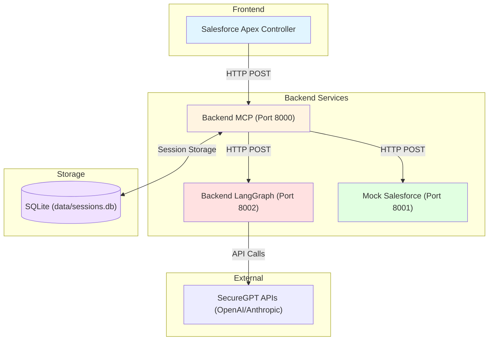
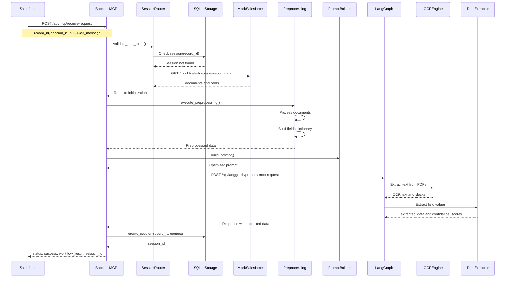
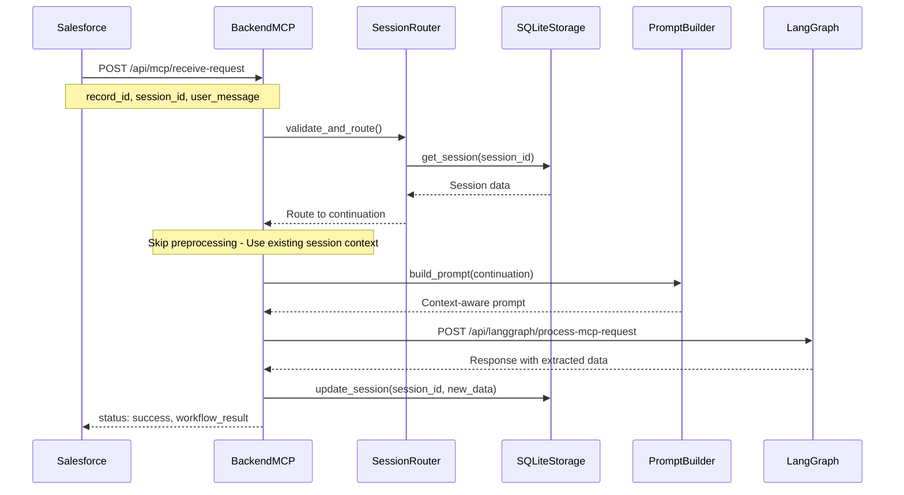
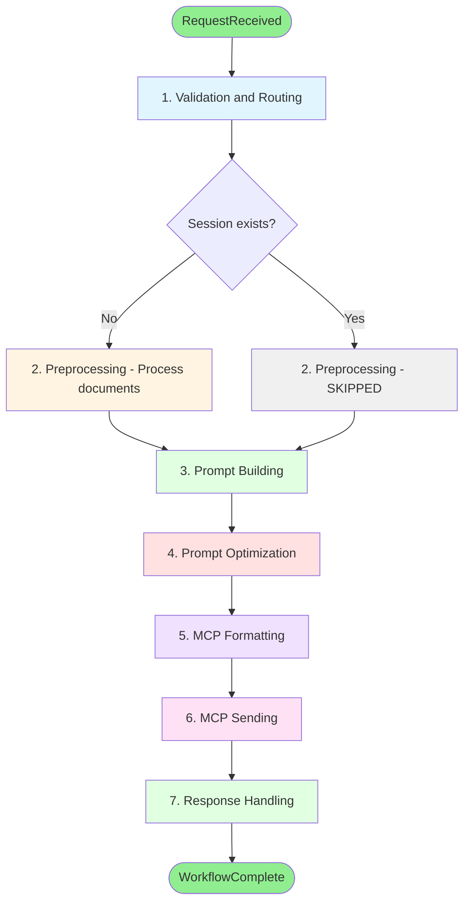
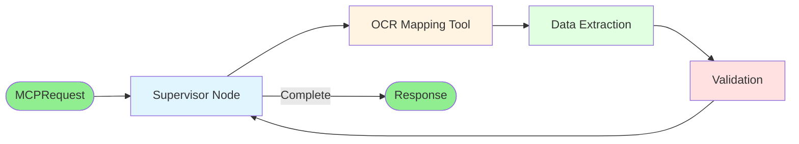

# Architecture OptiClaims - Documentation Complète

Ce document décrit l'architecture complète du système OptiClaims, incluant les flux de données, les interactions entre services, et les détails d'implémentation.

## Vue d'Ensemble

OptiClaims est un système de traitement intelligent de sinistres qui utilise l'IA générative pour extraire des données depuis des documents PDF et remplir automatiquement des formulaires Salesforce.

### Composants Principaux

1. **Backend MCP** : Orchestration du workflow, gestion des sessions, communication avec Salesforce
2. **Backend LangGraph** : Agent GenAI pour l'extraction de données depuis documents
3. **Mock Salesforce** : Service de simulation pour les tests
4. **SQLite** : Stockage de session (fichier `data/sessions.db`)

## Architecture des Services



## Flux de Données Principal

### 1. Flux d'Initialisation (Nouvelle Session)



### 2. Flux de Continuation (Session Existante)



## Workflow Orchestrator - Étapes Détaillées

Le Workflow Orchestrator coordonne 7 étapes principales :



### Détails des Étapes

#### Étape 1: Validation & Routing

- Validation des paramètres d'entrée (record_id, session_id, user_message)
- Vérification de l'existence de la session dans SQLite
- Décision : Initialization ou Continuation
- Récupération des données Salesforce si nouvelle session

#### Étape 2: Preprocessing

- **Initialization** : Traitement des documents, construction du dictionnaire de champs
- **Continuation** : Ignoré (utilise le contexte de session existante)

#### Étape 3: Prompt Building

- Construction du prompt selon le type de scénario (extraction, clarification, validation)
- Intégration du contexte (documents, champs, historique de session)

#### Étape 4: Prompt Optimization

- Optimisation du prompt pour améliorer la précision
- Application de techniques de prompt engineering

#### Étape 5: MCP Formatting

- Formatage du message selon le protocole MCP
- Préparation du contexte (documents en base64, fields dictionary)

#### Étape 6: MCP Sending

- Envoi du message formaté au service LangGraph
- Gestion des retries et timeouts
- Réception de la réponse avec données extraites

#### Étape 7: Response Handling

- Extraction des données et scores de confiance
- Construction de la réponse finale
- Mise à jour de la session (si applicable)

## Backend LangGraph - Architecture

Le service LangGraph utilise un graphe d'état pour orchestrer l'extraction de données :



### État LangGraph (MCPAgentState)

```python
{
    "record_id": str,
    "session_id": Optional[str],
    "user_request": str,
    "documents": List[Document],
    "fields_dictionary": Dict[str, FieldDefinition],
    "messages": List[Message],
    "extracted_data": Dict[str, Any],
    "confidence_scores": Dict[str, float],
    "quality_score": float,
    "field_mappings": Dict[str, str],
    "ocr_text": str,
    "text_blocks": List[TextBlock],
    "remaining_steps": int
}
```

## Gestion des Sessions

### Structure de Session dans SQLite (Refactorisée)

Les sessions sont stockées dans une table SQLite `sessions` avec une structure refactorisée qui sépare clairement les données d'entrée (input) et les réponses du langgraph :

```sql
CREATE TABLE sessions (
    session_id TEXT PRIMARY KEY,
    record_id TEXT NOT NULL,
    created_at TEXT NOT NULL,
    updated_at TEXT NOT NULL,
    expires_at TEXT NOT NULL,
    status TEXT NOT NULL DEFAULT 'active',
    input_data TEXT NOT NULL,              -- JSON: données envoyées au langgraph
    langgraph_response TEXT,                -- JSON: réponse du langgraph
    interactions_history TEXT,              -- JSON array: historique des interactions
    processing_metadata TEXT               -- JSON: métadonnées de traitement
)

-- Index pour performance
CREATE INDEX idx_expires_at ON sessions(expires_at);
CREATE INDEX idx_record_id ON sessions(record_id);
CREATE INDEX idx_status ON sessions(status);
```

### Structure JSON Détaillée

#### `input_data` (JSON)

Contient toutes les données envoyées au langgraph :

```json
{
    "salesforce_data": {
        "record_id": "001XX000001",
        "record_type": "Claim",
        "documents": [...],
        "fields_to_fill": [...]
    },
    "user_message": "Extract data from documents",
    "context": {
        "documents": [...],
        "fields": [...],
        "session_id": "uuid"
    },
    "metadata": {
        "record_id": "001XX000001",
        "record_type": "Claim",
        "timestamp": "2024-01-15T10:30:00Z"
    },
    "prompt": "Full prompt text...",
    "timestamp": "2024-01-15T10:30:00Z"
}
```

#### `langgraph_response` (JSON)

Contient la réponse complète du langgraph :

```json
{
    "extracted_data": {
        "field_name": "value",
        ...
    },
    "confidence_scores": {
        "field_name": 0.95,
        ...
    },
    "quality_score": 0.92,
    "field_mappings": {
        "field_name": "text_location"
    },
    "processing_time": 2.5,
    "ocr_text_length": 5000,
    "text_blocks_count": 25,
    "timestamp": "2024-01-15T10:30:05Z",
    "status": "success"
}
```

#### `interactions_history` (JSON Array)

Historique complet des interactions avec traçabilité :

```json
[
    {
        "interaction_id": "uuid",
        "request": {
            "user_message": "...",
            "prompt": "...",
            "timestamp": "2024-01-15T10:30:00Z"
        },
        "response": {
            "extracted_data": {...},
            "confidence_scores": {...},
            "timestamp": "2024-01-15T10:30:05Z"
        },
        "processing_time": 2.5,
        "status": "success"
    },
    ...
]
```

#### `processing_metadata` (JSON)

Métadonnées de traitement avec timestamps :

```json
{
    "preprocessing_completed": true,
    "preprocessing_timestamp": "2024-01-15T10:30:02Z",
    "prompt_built": true,
    "prompt_built_timestamp": "2024-01-15T10:30:03Z",
    "langgraph_processed": true,
    "langgraph_processed_timestamp": "2024-01-15T10:30:05Z",
    "workflow_id": "uuid",
    "total_processing_time": 5.2,
    "additional_metadata": {}
}
```

### Avantages de la Nouvelle Structure

1. **Séparation claire** : Input et output sont dans des colonnes distinctes
2. **Traçabilité** : Historique complet des interactions dans `interactions_history`
3. **Requêtes SQL efficaces** : Possibilité de filtrer/rechercher sur des colonnes spécifiques
4. **Debugging facilité** : Accès direct aux données d'entrée et de sortie
5. **Évolutivité** : Facile d'ajouter de nouvelles colonnes sans casser l'existant
6. **Performance** : Index sur les colonnes fréquemment utilisées

### Cycle de Vie d'une Session

```mermaid
stateDiagram-v2
    [*] --> Created: POST /api/mcp/receive-request
    Note right of Created: session_id: null
    Created --> Active: Session stored in SQLite
    Active --> Updated: Subsequent requests
    Updated --> Active: Continue processing
    Active --> Expired: TTL exceeded
    Updated --> Expired: TTL exceeded
    Expired --> [*]: Session deleted
```

## Format des Données

### Requête MCP

```json
{
    "record_id": "001XX000001",
    "session_id": "abc123" | null,
    "user_message": "Extract data from documents"
}
```

### Réponse Workflow

```json
{
    "status": "success" | "failed",
    "workflow_id": "uuid",
    "current_step": "response_handling" | null,
    "steps_completed": ["validation_routing", "preprocessing", ...],
    "data": {
        "routing": {...},
        "preprocessing": {...},
        "prompt_building": {...},
        "prompt_optimization": {...},
        "mcp_formatting": {...},
        "mcp_sending": {...},
        "response_handling": {
            "extracted_data": {
                "field_name": "value"
            },
            "confidence_scores": {
                "field_name": 0.95
            },
            "final_status": "success"
        }
    },
    "errors": [],
    "started_at": "2024-01-15T10:30:00Z",
    "completed_at": "2024-01-15T10:30:45Z"
}
```

## Logging et Monitoring

### Format des Logs

Le système supporte deux formats de logs :

1. **Console Format** (par défaut) : Logs lisibles avec couleurs
2. **JSON Format** : Logs structurés pour l'agrégation

### Informations Loggées

- **Progression** : Pourcentage et étape actuelle
- **Timing** : Temps d'exécution par étape
- **Contexte** : record_id, session_id, workflow_id
- **Erreurs** : Stack traces et contexte complet

### Exemple de Log Console

```
2024-01-15 10:30:45 INFO     [14%] Step 1/7: validation_routing - Starting Validation & Routing (record_id=001XX000001)
2024-01-15 10:30:45 INFO     Step 1 completed: Validation & Routing (took 0.12s)
2024-01-15 10:30:46 INFO     [28%] Step 2/7: preprocessing - Starting Preprocessing (record_id=001XX000001)
2024-01-15 10:30:47 INFO     Step 2 completed: Preprocessing (took 1.23s)
...
2024-01-15 10:30:50 INFO     Workflow execution completed successfully (took 5.67s)
```

## Sécurité

### Bonnes Pratiques Implémentées

1. **Validation des Entrées** : Tous les paramètres sont validés avec Pydantic
2. **Gestion d'Erreurs Défensive** : Try/except à tous les niveaux
3. **Logging Sécurisé** : Pas d'exposition de secrets dans les logs
4. **Timeouts** : Timeouts configurés pour toutes les requêtes externes
5. **Retries** : Mécanisme de retry avec backoff exponentiel

### Points d'Attention

- Les clés API doivent être stockées dans des variables d'environnement
- SQLite est inclus dans Python, aucune configuration supplémentaire requise
- Les documents PDF peuvent être volumineux (limite de taille recommandée)

## Performance

### Optimisations

1. **Réutilisation des Messages MCP** : Formatage une seule fois
2. **Cache de Session** : Sessions stockées dans SQLite
3. **Traitement Asynchrone** : Utilisation d'async/await
4. **Retries Intelligents** : Backoff exponentiel pour les erreurs temporaires

### Métriques Typiques

- **Validation & Routing** : ~100-200ms
- **Preprocessing** : ~500-2000ms (selon nombre de documents)
- **Prompt Building** : ~50-100ms
- **Prompt Optimization** : ~100-200ms
- **MCP Formatting** : ~50-100ms
- **MCP Sending** : ~2000-10000ms (selon complexité des documents)
- **Response Handling** : ~50-100ms

**Total** : ~3-15 secondes selon la complexité

## Évolutivité

### Architecture Scalable

- **Services Déployables Indépendamment** : Chaque service peut être mis à l'échelle séparément
- **SQLite pour le Stockage de Session** : Solution simple et efficace pour le développement
- **Stateless Services** : Les services sont stateless (sauf SQLite pour les sessions)

### Recommandations pour la Production

1. **Load Balancer** : Devant chaque service
2. **Base de Données Production** : Pour la production, considérer PostgreSQL ou une base de données partagée pour le scaling horizontal
3. **Monitoring** : APM (Application Performance Monitoring)
4. **Logging Centralisé** : ELK Stack ou équivalent
5. **Rate Limiting** : Pour protéger les APIs
6. **Health Checks** : Endpoints `/health` pour le monitoring

## Conclusion

Cette architecture permet un traitement robuste et scalable des sinistres avec extraction intelligente de données depuis documents. Le système est conçu pour être modulaire, maintenable et évolutif.

Pour plus de détails sur l'utilisation, consultez :

- [README.md](../README.md)
- [INSTALLATION_GUIDE.md](INSTALLATION_GUIDE.md)
- [PIPELINE_DOCUMENTATION.md](PIPELINE_DOCUMENTATION.md)
