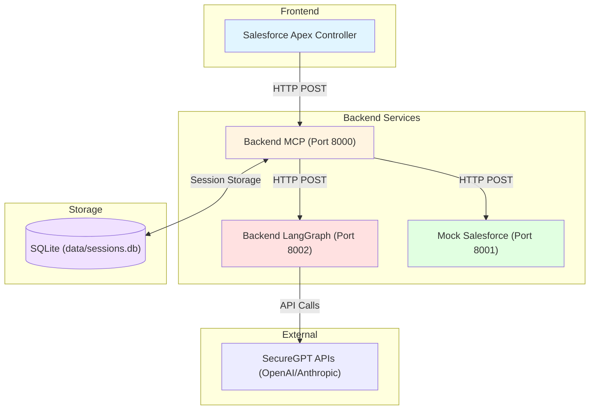
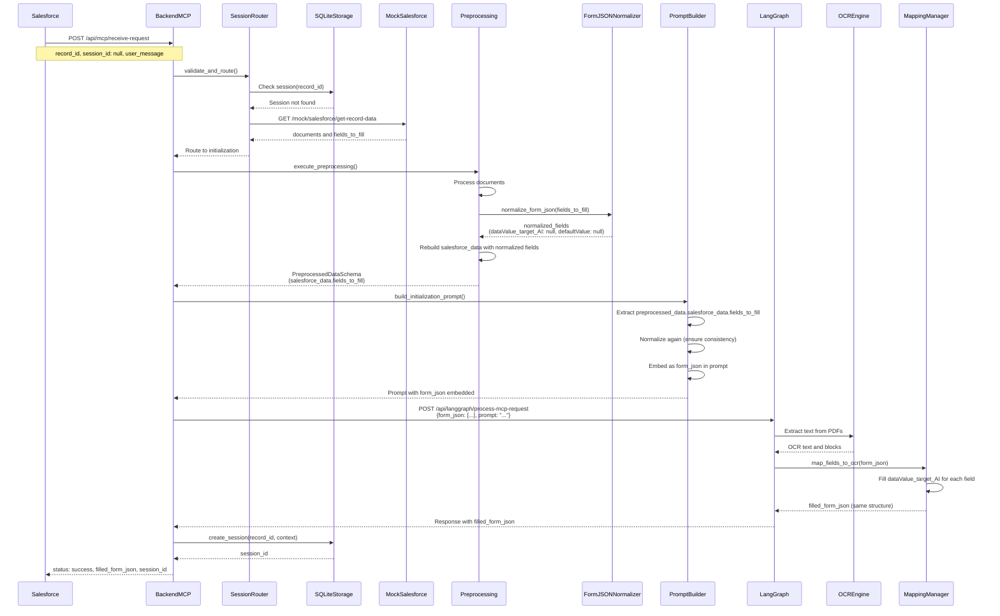
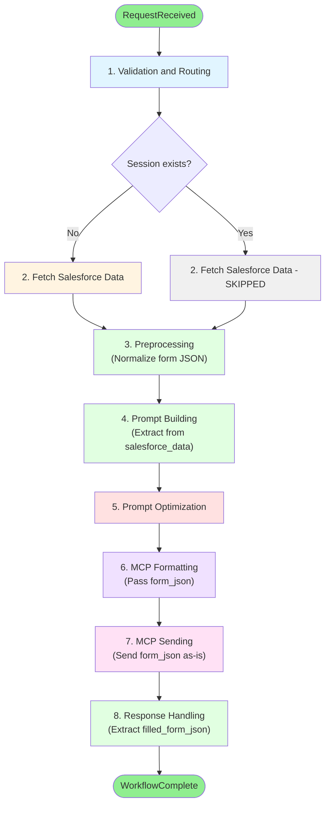
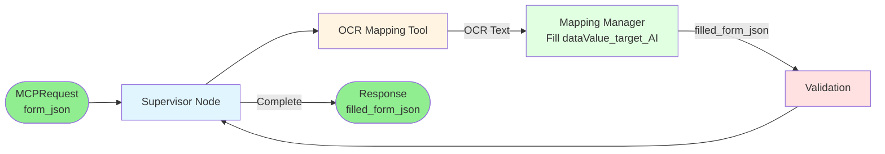

# Architecture OptiClaims - Documentation Complète

Ce document décrit l'architecture complète du système OptiClaims, incluant les flux de données, les interactions entre services, et les détails d'implémentation.

## Vue d'Ensemble

OptiClaims est un système de traitement intelligent de sinistres qui utilise l'IA générative pour extraire des données depuis des documents PDF et remplir automatiquement des formulaires Salesforce.

### Architecture Simplifiée : Form JSON As-Is

L'architecture actuelle utilise une approche simplifiée où les champs du formulaire sont envoyés **tels quels** (as-is) à travers tout le pipeline, avec seulement une normalisation minimale pour ajouter `dataValue_target_AI` et s'assurer que `defaultValue` est `null`.

### Composants Principaux

1. **Backend MCP** : Orchestration du workflow, gestion des sessions, communication avec Salesforce
2. **Backend LangGraph** : Agent GenAI pour l'extraction de données depuis documents
3. **Mock Salesforce** : Service de simulation pour les tests
4. **SQLite** : Stockage de session (fichier `data/sessions.db`)

## Architecture des Services



## Flux de Données Principal

### Architecture Simplifiée : Form JSON As-Is

```mermaid
flowchart TD
    Start([Salesforce Data]) --> Norm[Normalize Form JSON]
    Norm -->|Add dataValue_target_AI: null<br/>Set defaultValue: null| Normalized[Normalized Form JSON]
    Normalized --> Preprocess[Preprocessing Pipeline]
    Preprocess -->|Store in| PreprocessedData[PreprocessedDataSchema<br/>salesforce_data.fields_to_fill]
    PreprocessedData --> Prompt[Prompt Builder]
    Prompt -->|Extract| ExtractFields[fields_to_fill from<br/>salesforce_data]
    ExtractFields -->|Embed as JSON string| PromptText[Prompt with form_json]
    PromptText --> MCP[MCP Formatter]
    MCP -->|Pass form_json| MCPMessage[MCPMessageSchema<br/>context.form_json]
    MCPMessage --> Langgraph[Langgraph Endpoint]
    Langgraph -->|Store in state| State[MCPAgentState<br/>form_json: List[Dict]]
    State --> Mapping[Mapping Manager]
    Mapping -->|Fill dataValue_target_AI| Filled[filled_form_json<br/>Same structure + values]
    Filled --> Response[Response with<br/>filled_form_json]
    
    style Norm fill:#e1f5ff
    style Normalized fill:#e1f5ff
    style PreprocessedData fill:#fff4e1
    style ExtractFields fill:#fff4e1
    style PromptText fill:#e1ffe1
    style MCPMessage fill:#e1ffe1
    style State fill:#ffe1e1
    style Filled fill:#c8e6c9
    style Response fill:#c8e6c9
```

### 1. Flux d'Initialisation (Nouvelle Session)



### 2. Flux de Continuation (Session Existante)


## Structure de Données

### Input Format (Salesforce)

```json
{
  "record_id": "001XX000001",
  "record_type": "Claim",
  "documents": [
    {
      "document_id": "doc_123",
      "name": "facture.pdf",
      "url": "https://...",
      "type": "application/pdf",
      "indexed": true
    }
  ],
  "fields_to_fill": [
    {
      "label": "Evènement déclencheur de sinistre",
      "apiName": null,
      "type": "picklist",
      "required": true,
      "possibleValues": ["Accident", "Assistance", "Bris de glace"],
      "defaultValue": "Accident"
    }
  ]
}
```

### Normalized Form JSON (After Preprocessing)

```json
{
  "record_id": "001XX000001",
  "record_type": "Claim",
  "processed_documents": [...],
  "salesforce_data": {
    "record_id": "001XX000001",
    "record_type": "Claim",
    "documents": [...],
    "fields_to_fill": [
      {
        "label": "Evènement déclencheur de sinistre",
        "apiName": null,
        "type": "picklist",
        "required": true,
        "possibleValues": ["Accident", "Assistance", "Bris de glace"],
        "defaultValue": null,
        "dataValue_target_AI": null
      }
    ]
  }
}
```

### Output Format (Filled Form JSON)

```json
{
  "filled_form_json": [
    {
      "label": "Evènement déclencheur de sinistre",
      "apiName": null,
      "type": "picklist",
      "required": true,
      "possibleValues": ["Accident", "Assistance", "Bris de glace"],
      "defaultValue": null,
      "dataValue_target_AI": "Accident",
      "confidence": 0.98
    }
  ]
}
```

## Workflow Orchestrator - Étapes Détaillées

Le Workflow Orchestrator coordonne 8 étapes principales :



### Détails des Étapes

#### Étape 1: Validation & Routing

- Validation des paramètres d'entrée (record_id, session_id, user_message)
- Vérification de l'existence de la session dans SQLite
- Décision : Initialization ou Continuation
- Récupération des données Salesforce si nouvelle session

#### Étape 2: Fetch Salesforce Data (Initialization uniquement)

- Appel à Mock Salesforce
- Récupération documents + `fields_to_fill` (format original)
- Création de session

#### Étape 3: Preprocessing

- **Document Processing** : Traitement des documents (sans quality_score)
- **Form JSON Normalization** :
  - Normalise `fields_to_fill` : ajoute `dataValue_target_AI: null`, force `defaultValue: null`
  - Reconstruit `SalesforceDataResponseSchema` avec champs normalisés
  - Stocke dans `PreprocessedDataSchema.salesforce_data.fields_to_fill`
- **Context Summary** : Génération du résumé de contexte

#### Étape 4: Prompt Building

- Extraction de `preprocessed_data.salesforce_data.fields_to_fill`
- Normalisation (vérification de cohérence)
- Conversion en JSON string
- Intégration dans le prompt comme variable `form_json`
- Template Jinja2 : `{{ form_json }}`

#### Étape 5: Prompt Optimization

- Optimisation du prompt pour améliorer la précision
- Application de techniques de prompt engineering

#### Étape 6: MCP Formatting

- Formatage du message selon le protocole MCP
- Extraction de `form_json` depuis le contexte
- Normalisation si nécessaire
- Passage dans `MCPMessageSchema.context.form_json`

#### Étape 7: MCP Sending

- Conversion du message MCP au format Langgraph
- Envoi de `form_json` **tel quel** (pas de conversion en `fields_dictionary`)
- Gestion des retries et timeouts
- Réception de la réponse avec `filled_form_json`

#### Étape 8: Response Handling

- Extraction de `filled_form_json` depuis la réponse Langgraph
- Construction de la réponse finale
- Mise à jour de la session (si applicable)

## Backend LangGraph - Architecture

Le service LangGraph utilise un graphe d'état pour orchestrer l'extraction de données :



### État LangGraph (MCPAgentState)

```python
{
    "record_id": str,
    "session_id": Optional[str],
    "user_request": str,
    "documents": List[Document],
    "form_json": List[Dict[str, Any]],  # Form JSON as-is from input
    "filled_form_json": Optional[List[Dict[str, Any]]],  # Output with dataValue_target_AI filled
    "fields_dictionary": Dict[str, Any],  # Deprecated: kept for compatibility
    "messages": List[Message],
    "extracted_data": Dict[str, Any],  # Deprecated: kept for backward compatibility
    "confidence_scores": Dict[str, float],
    "quality_score": Optional[float],
    "field_mappings": Dict[str, str],
    "ocr_text": str,
    "text_blocks": List[TextBlock],
    "remaining_steps": int
}
```

### Mapping Manager - Golden Rule

Le Mapping Manager implémente la **Règle d'Or** :

- **Si l'information n'est PAS trouvée dans le texte OCR** → `dataValue_target_AI = "non disponible"`
- **Ne JAMAIS utiliser `null` ou chaîne vide**
- **Le texte OCR est la référence unique de toutes les informations**

#### Pour les champs avec `possibleValues` (picklist, radio) :
- Analyser le texte OCR
- Identifier la valeur la plus proche parmi `possibleValues`
- Insérer EXACTEMENT cette valeur dans `dataValue_target_AI`
- Si aucune valeur ne correspond → `"non disponible"`

#### Pour les champs sans `possibleValues` (text, number, textarea) :
- Analyser le texte OCR
- Extraire la valeur directement depuis le texte
- Insérer dans `dataValue_target_AI`
- Si la valeur n'est pas trouvée → `"non disponible"`

## Gestion des Sessions

### Structure de Session dans SQLite

Les sessions sont stockées dans une table SQLite `sessions` :

```sql
CREATE TABLE sessions (
    session_id TEXT PRIMARY KEY,
    record_id TEXT NOT NULL,
    created_at TEXT NOT NULL,
    updated_at TEXT NOT NULL,
    expires_at TEXT NOT NULL,
    status TEXT NOT NULL DEFAULT 'active',
    input_data TEXT NOT NULL,              -- JSON: données envoyées au langgraph
    langgraph_response TEXT,                -- JSON: réponse du langgraph
    interactions_history TEXT,              -- JSON array: historique des interactions
    processing_metadata TEXT               -- JSON: métadonnées de traitement
)

-- Index pour performance
CREATE INDEX idx_expires_at ON sessions(expires_at);
CREATE INDEX idx_record_id ON sessions(record_id);
CREATE INDEX idx_status ON sessions(status);
```

### Structure JSON Détaillée

#### `input_data` (JSON)

Contient toutes les données envoyées au langgraph :

```json
{
    "salesforce_data": {
        "record_id": "001XX000001",
        "record_type": "Claim",
        "documents": [...],
        "fields_to_fill": [
            {
                "label": "...",
                "type": "picklist",
                "possibleValues": [...],
                "defaultValue": null,
                "dataValue_target_AI": null
            }
        ]
    },
    "user_message": "Extract data from documents",
    "context": {
        "documents": [...],
        "form_json": [...],
        "session_id": "uuid"
    },
    "metadata": {
        "record_id": "001XX000001",
        "record_type": "Claim",
        "timestamp": "2024-01-15T10:30:00Z"
    },
    "prompt": "Full prompt text with form_json embedded...",
    "timestamp": "2024-01-15T10:30:00Z"
}
```

#### `langgraph_response` (JSON)

Contient la réponse complète du langgraph :

```json
{
    "filled_form_json": [
        {
            "label": "...",
            "type": "picklist",
            "possibleValues": [...],
            "defaultValue": null,
            "dataValue_target_AI": "Accident",
            "confidence": 0.98
        }
    ],
    "confidence_scores": {
        "Evènement déclencheur de sinistre": 0.98
    },
    "processing_time": 2.5,
    "ocr_text_length": 5000,
    "text_blocks_count": 25,
    "timestamp": "2024-01-15T10:30:05Z",
    "status": "success"
}
```

## Format des Données

### Requête MCP

```json
{
    "record_id": "001XX000001",
    "session_id": "abc123" | null,
    "user_message": "Extract data from documents"
}
```

### Réponse Workflow

```json
{
    "status": "success" | "failed",
    "workflow_id": "uuid",
    "current_step": "response_handling" | null,
    "steps_completed": ["validation_routing", "preprocessing", ...],
    "data": {
        "routing": {...},
        "preprocessing": {...},
        "prompt_building": {...},
        "prompt_optimization": {...},
        "mcp_formatting": {...},
        "mcp_sending": {...},
        "response_handling": {
            "filled_form_json": [
                {
                    "label": "...",
                    "dataValue_target_AI": "value or 'non disponible'",
                    "confidence": 0.95
                }
            ],
            "confidence_scores": {...},
            "final_status": "success"
        }
    },
    "filled_form_json": [...],  // At root level for easy access
    "errors": [],
    "started_at": "2024-01-15T10:30:00Z",
    "completed_at": "2024-01-15T10:30:45Z"
}
```

## Composants Supprimés

Les composants suivants ont été **supprimés** de l'architecture :

- ❌ `fields_preprocessor.py` - Supprimé
- ❌ `EnrichedFieldSchema` - Supprimé
- ❌ `FieldsDictionarySchema` - Supprimé
- ❌ `FieldToFillResponseSchema` - Supprimé (conversion logic)
- ❌ `quality_score` dans documents - Supprimé
- ❌ `validate_document_quality()` - Supprimé

## Points de Transformation

### 1. Normalisation (Form JSON Normalizer)

**Localisation** : `backend-mcp/app/services/preprocessing/form_json_normalizer.py`

**Transformation** :
- Ajoute `dataValue_target_AI: null` si absent
- Force `defaultValue: null` pour tous les champs
- Préserve tous les autres champs (label, type, possibleValues, etc.)

**Input** : `List[SalesforceFormFieldSchema]`
**Output** : `List[Dict]` avec normalisation

### 2. Mapping (Mapping Manager)

**Localisation** : `backend-langgraph/app/nodes/ocr_mapping_tool/mapping_manager.py`

**Transformation** :
- Remplit `dataValue_target_AI` pour chaque champ
- Ajoute `confidence` (0.0-1.0)
- Applique la Règle d'Or : `"non disponible"` si non trouvé

**Input** : `form_json: List[Dict]` avec `dataValue_target_AI: null`
**Output** : `filled_form_json: List[Dict]` avec `dataValue_target_AI` rempli

## Logging et Monitoring

### Format des Logs

Le système supporte deux formats de logs :

1. **Console Format** (par défaut) : Logs lisibles avec couleurs
2. **JSON Format** : Logs structurés pour l'agrégation

### Informations Loggées

- **Progression** : Pourcentage et étape actuelle
- **Timing** : Temps d'exécution par étape
- **Contexte** : record_id, session_id, workflow_id
- **Form JSON** : Nombre de champs, structure
- **Erreurs** : Stack traces et contexte complet

## Sécurité

### Bonnes Pratiques Implémentées

1. **Validation des Entrées** : Tous les paramètres sont validés avec Pydantic
2. **Gestion d'Erreurs Défensive** : Try/except à tous les niveaux
3. **Logging Sécurisé** : Pas d'exposition de secrets dans les logs
4. **Timeouts** : Timeouts configurés pour toutes les requêtes externes
5. **Retries** : Mécanisme de retry avec backoff exponentiel

## Performance

### Métriques Typiques

- **Validation & Routing** : ~100-200ms
- **Preprocessing** : ~500-2000ms (selon nombre de documents)
- **Prompt Building** : ~50-100ms
- **Prompt Optimization** : ~100-200ms
- **MCP Formatting** : ~50-100ms
- **MCP Sending** : ~2000-10000ms (selon complexité des documents)
- **Response Handling** : ~50-100ms

**Total** : ~3-15 secondes selon la complexité

## Évolutivité

### Architecture Scalable

- **Services Déployables Indépendamment** : Chaque service peut être mis à l'échelle séparément
- **SQLite pour le Stockage de Session** : Solution simple et efficace pour le développement
- **Stateless Services** : Les services sont stateless (sauf SQLite pour les sessions)

### Recommandations pour la Production

1. **Load Balancer** : Devant chaque service
2. **Base de Données Production** : Pour la production, considérer PostgreSQL ou une base de données partagée pour le scaling horizontal
3. **Monitoring** : APM (Application Performance Monitoring)
4. **Logging Centralisé** : ELK Stack ou équivalent
5. **Rate Limiting** : Pour protéger les APIs
6. **Health Checks** : Endpoints `/health` pour le monitoring

## LangGraph : Un seul flux IFX, routing par intention

Le Backend LangGraph utilise **un seul flux d’entrée** : l’Orchestrator (Supervisor) reçoit la requête utilisateur et route selon **l’intention (message utilisateur) + l’état** (Shared Storage, `filled_form_json`).

### Intentions supportées

| Intention | Exemple de message | Comportement |
|-----------|--------------------|--------------|
| **process_documents** | « Traiter les documents », « clôturer ces documents » | OCR Synthesizer → Shared Storage → **fin** (résumé, pas de préremplissage ni Q/A) |
| **prefill_form** | « Préremplir », « pre-fill » | Pre-filling Manager (template depuis Shared Storage). Si pas de template → OCR d’abord. |
| **qa_session** | « Questions », « Q&A », « vérifier » | Q/A Manager (avec formulaire prérempli) |
| **full_pipeline** | « Tout faire », « pipeline complet » | OCR (si besoin) → Pre-fill → Q/A |

### Réponses utilisateur et API

- **user_response_message** : message de résumé/confirmation après chaque étape (ex. après OCR, après préremplissage).
- **step_completed** : indicateur optionnel `ocr_only` \| `prefill` \| `qa` \| `full` pour adapter l’affichage frontend.
- **filled_form_json** : reste le format de sortie principal ; les champs ci-dessus sont additifs.

### Rollback

Pour désactiver le routing par intention et revenir à un flux séquentiel : dans `config_agent.yaml`, définir `use_intent_routing: false` (ou commenter la clé pour garder la valeur par défaut `true`).

## Conclusion

Cette architecture simplifiée permet un traitement robuste et scalable des sinistres avec extraction intelligente de données depuis documents. Le système est conçu pour être modulaire, maintenable et évolutif, avec une préservation maximale des informations originales.

Pour plus de détails sur l'utilisation, consultez :

- [README.md](../README.md)
- [INSTALLATION_GUIDE.md](INSTALLATION_GUIDE.md)
- [PIPELINE_FLOW.md](PIPELINE_FLOW.md)
- [PIPELINE_DOCUMENTATION.md](PIPELINE_DOCUMENTATION.md)
