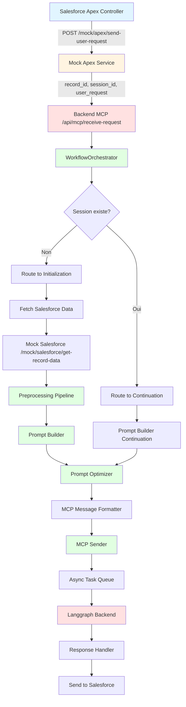
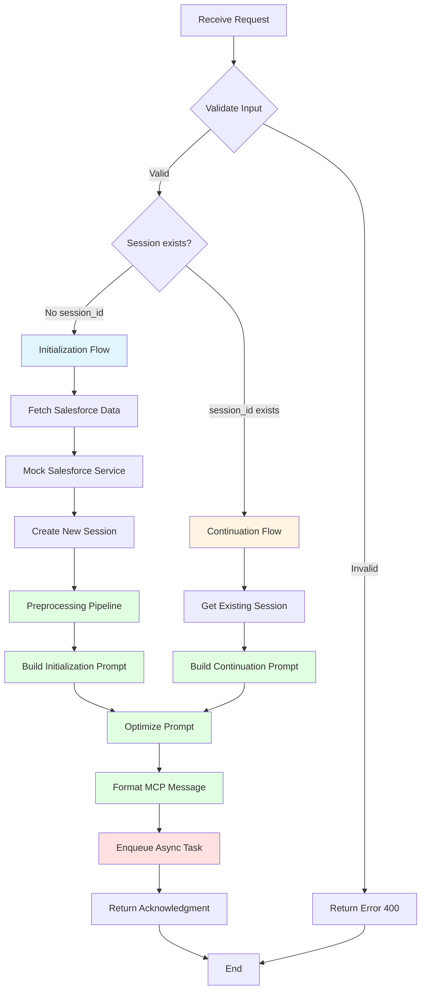

# Documentation Complète - Pipeline OptiClaims

## État d'Avancement du Projet

> **Note** : Pour les spécifications API complètes, consultez [API_REFERENCE.md](API_REFERENCE.md)  
> Pour les diagrammes de flux détaillés, consultez [PIPELINE_FLOW.md](PIPELINE_FLOW.md)

### Services Implémentés ✅

#### 1. Mock Salesforce Service (Port 8001)
- **Statut** : ✅ **Complètement implémenté**
- **Endpoints** :
  - `POST /mock/salesforce/get-record-data` : Récupération données mock
  - `POST /mock/apex/send-user-request` : Simulation envoi requête Apex
  - `GET /health` : Health check

#### 2. Backend MCP Service (Port 8000)
- **Statut** : ✅ **Complètement implémenté**
- **Endpoints** :
  - `POST /api/mcp/receive-request` : Endpoint principal avec workflow complet
  - `POST /api/mcp/request-salesforce-data` : Endpoint interne
  - `GET /api/task-status/{task_id}` : Statut des tâches async
  - `GET /health` : Health check

#### 3. Workflow Orchestrator
- **Statut** : ✅ **Complètement implémenté**
- **Fonctionnalités** :
  - ✅ Validation & Routing (Étape 1)
  - ✅ Fetch Salesforce Data (Étape 2)
  - ✅ Preprocessing (Étape 3)
  - ✅ Prompt Building (Étape 4)
  - ✅ Prompt Optimization (Étape 5)
  - ✅ MCP Formatting (Étape 6)
  - ✅ MCP Sending (Étape 7)
  - ✅ Response Handling (Étape 8)

#### 4. Backend LangGraph Service (Port 8002)
- **Statut** : ✅ **Complètement implémenté**
- **Endpoints** :
  - `POST /api/langgraph/process-mcp-request` : Traitement OCR + Extraction
  - `GET /health` : Health check
- **Fonctionnalités** :
  - ✅ OCR Processing
  - ✅ Field Mapping
  - ✅ Data Extraction
  - ✅ Validation & Quality Scoring

### Services en Développement

#### 5. Monitoring Dashboard
- **Statut** : ⏳ À venir
- **Fonctionnalités prévues** :
  - Dashboard de monitoring en temps réel
  - Visualisation des workflows
  - Métriques de performance

## Architecture du Pipeline

### Diagramme de Flux Principal



## Documentation des Endpoints

> **⚠️ IMPORTANT** : Cette section contient une vue d'ensemble. Pour les **spécifications complètes input/output**, consultez **[API_REFERENCE.md](API_REFERENCE.md)**.

### 1. Mock Salesforce - Get Record Data

**Endpoint** : `POST /mock/salesforce/get-record-data`  
**Service** : Mock Salesforce (Port 8001)  
**Description** : Récupère les données mock (documents + champs) pour un record_id

#### Input

```json
{
  "record_id": "001XX000001"
}
```

**Format exact** :
- `record_id` : string (requis, min 1 caractère, format Salesforce ID)

#### Output (Succès)

```json
{
  "status": "success",
  "data": {
    "record_id": "001XX000001",
    "record_type": "Claim",
    "documents": [
      {
        "document_id": "doc_1",
        "name": "facture_001.pdf",
        "url": "https://example.com/documents/facture_001.pdf",
        "type": "application/pdf",
        "indexed": true
      },
      {
        "document_id": "doc_2",
        "name": "photo_dommages_001.jpg",
        "url": "https://example.com/documents/photo_dommages_001.jpg",
        "type": "image/jpeg",
        "indexed": true
      }
    ],
    "fields_to_fill": [
      {
        "field_name": "montant_total",
        "field_type": "currency",
        "value": null,
        "required": true,
        "label": "Montant total"
      },
      {
        "field_name": "date_facture",
        "field_type": "date",
        "value": null,
        "required": true,
        "label": "Date de facture"
      },
      {
        "field_name": "numero_facture",
        "field_type": "text",
        "value": null,
        "required": true,
        "label": "Numéro de facture"
      },
      {
        "field_name": "beneficiaire_nom",
        "field_type": "text",
        "value": null,
        "required": true,
        "label": "Nom du bénéficiaire"
      }
    ]
  }
}
```

#### Output (Erreur)

```json
{
  "status": "error",
  "error": {
    "code": "RECORD_NOT_FOUND",
    "message": "Record 001XX000999 not found in mock data",
    "details": null
  }
}
```

#### Exemples de Test

**Test 1 : Record existant**
```bash
curl -X POST http://localhost:8001/mock/salesforce/get-record-data \
  -H "Content-Type: application/json" \
  -d '{"record_id": "001XX000001"}'
```

**Test 2 : Record inexistant**
```bash
curl -X POST http://localhost:8001/mock/salesforce/get-record-data \
  -H "Content-Type: application/json" \
  -d '{"record_id": "001XX000999"}'
```

**Test 3 : Record avec plusieurs documents**
```bash
curl -X POST http://localhost:8001/mock/salesforce/get-record-data \
  -H "Content-Type: application/json" \
  -d '{"record_id": "001XX000003"}'
```

### 2. Mock Apex - Send User Request

**Endpoint** : `POST /mock/apex/send-user-request`  
**Service** : Mock Salesforce (Port 8001)  
**Description** : Simule l'envoi d'une requête utilisateur depuis Salesforce Apex

#### Input

```json
{
  "record_id": "001XX000001",
  "session_id": null,
  "user_request": "Remplis tous les champs manquants"
}
```

**Format exact** :
- `record_id` : string (requis, min 1 caractère)
- `session_id` : string | null (optionnel, null pour nouvelle session)
- `user_request` : string (requis, min 1 caractère)

#### Output (Succès)

```json
{
  "status": "success",
  "data": {
    "status": "sent",
    "request_id": "550e8400-e29b-41d4-a716-446655440000",
    "record_id": "001XX000001",
    "session_id": null,
    "timestamp": "2024-01-15T10:30:00.000Z"
  }
}
```

#### Exemples de Test

**Test 1 : Nouvelle session (session_id = null)**
```bash
curl -X POST http://localhost:8001/mock/apex/send-user-request \
  -H "Content-Type: application/json" \
  -d '{
    "record_id": "001XX000001",
    "session_id": null,
    "user_request": "Remplis tous les champs manquants"
  }'
```

**Test 2 : Session continue (session_id existant)**
```bash
curl -X POST http://localhost:8001/mock/apex/send-user-request \
  -H "Content-Type: application/json" \
  -d '{
    "record_id": "001XX000001",
    "session_id": "session-123-456-789",
    "user_request": "Quel est le montant sur la facture ?"
  }'
```

**Test 3 : Requête de clarification**
```bash
curl -X POST http://localhost:8001/mock/apex/send-user-request \
  -H "Content-Type: application/json" \
  -d '{
    "record_id": "001XX000002",
    "session_id": "session-123-456-789",
    "user_request": "Corrige la date, elle semble incorrecte"
  }'
```

### 3. Backend MCP - Receive Request

**Endpoint** : `POST /api/mcp/receive-request`  
**Service** : Backend MCP (Port 8000)  
**Description** : Endpoint principal recevant les requêtes et orchestrant le workflow

#### Input

```json
{
  "record_id": "001XX000001",
  "session_id": null,
  "user_message": "Remplis tous les champs manquants"
}
```

**Format exact** :
- `record_id` : string (requis, min 1 caractère)
- `session_id` : string | null (optionnel)
- `user_message` : string (requis, min 1 caractère)

#### Output (Succès - Workflow Complet)

> **Note** : L'endpoint retourne maintenant le **workflow_result complet** avec toutes les étapes.  
> Voir [API_REFERENCE.md](API_REFERENCE.md) pour la structure complète.

```json
{
  "status": "success",
  "data": {
    "status": "completed",
    "workflow_id": "550e8400-e29b-41d4-a716-446655440000",
    "steps_completed": [
      "validation_routing",
      "preprocessing",
      "prompt_building",
      "prompt_optimization",
      "mcp_formatting",
      "mcp_sending",
      "response_handling"
    ],
    "data": {
      "routing": {...},
      "preprocessing": {...},
      "prompt_building": {...},
      "prompt_optimization": {...},
      "mcp_formatting": {...},
      "mcp_sending": {
        "mcp_response": {
          "extracted_data": {
            "montant_total": "1250.50",
            "date_facture": "2024-01-15"
          },
          "confidence_scores": {...}
        }
      },
      "response_handling": {
        "extracted_data": {...},
        "confidence_scores": {...},
        "final_status": "success"
      }
    }
  }
}
```

**Accès aux données extraites** :
- `response.data.data.response_handling.extracted_data` - Données extraites finales
- `response.data.data.response_handling.confidence_scores` - Scores de confiance

#### Output (Erreur)

```json
{
  "status": "error",
  "error": {
    "code": "INVALID_RECORD_ID",
    "message": "record_id cannot be empty",
    "details": null
  }
}
```

#### Exemples de Test

**Test 1 : Nouvelle session - Initialization Flow**
```bash
curl -X POST http://localhost:8000/api/mcp/receive-request \
  -H "Content-Type: application/json" \
  -d '{
    "record_id": "001XX000001",
    "session_id": null,
    "user_message": "Remplis tous les champs manquants"
  }'
```

**Test 2 : Session continue - Continuation Flow**
```bash
curl -X POST http://localhost:8000/api/mcp/receive-request \
  -H "Content-Type: application/json" \
  -d '{
    "record_id": "001XX000001",
    "session_id": "session-123-456-789",
    "user_message": "Quel est le montant sur la facture ?"
  }'
```

### 4. Backend MCP - Request Salesforce Data

**Endpoint** : `POST /api/mcp/request-salesforce-data`  
**Service** : Backend MCP (Port 8000)  
**Description** : Endpoint interne pour récupérer les données Salesforce

#### Input

```json
{
  "record_id": "001XX000001"
}
```

#### Output

Identique à l'endpoint Mock Salesforce `/mock/salesforce/get-record-data`

#### Exemple de Test

```bash
curl -X POST http://localhost:8000/api/mcp/request-salesforce-data \
  -H "Content-Type: application/json" \
  -d '{"record_id": "001XX000001"}'
```

### 5. Backend MCP - Task Status

**Endpoint** : `GET /api/task-status/{task_id}`  
**Service** : Backend MCP (Port 8000)  
**Description** : Récupère le statut d'une tâche asynchrone

#### Input

Paramètre URL : `task_id` (string, UUID)

#### Output (Succès)

```json
{
  "status": "success",
  "data": {
    "task_id": "550e8400-e29b-41d4-a716-446655440000",
    "status": "completed",
    "message": null,
    "result": {
      "extracted_data": {
        "montant_total": "1250.50",
        "date_facture": "2024-01-15",
        "numero_facture": "FAC-2024-001"
      },
      "confidence_scores": {
        "montant_total": 0.95,
        "date_facture": 0.88,
        "numero_facture": 0.92
      }
    },
    "created_at": "2024-01-15T10:30:00.000Z",
    "updated_at": "2024-01-15T10:32:15.000Z"
  }
}
```

#### Statuts possibles

- `pending` : Tâche en attente
- `processing` : Tâche en cours de traitement
- `completed` : Tâche terminée avec succès
- `failed` : Tâche échouée
- `not_found` : Tâche introuvable

#### Exemple de Test

```bash
curl -X GET http://localhost:8000/api/task-status/550e8400-e29b-41d4-a716-446655440000
```

## Diagramme de Flux Détaillé - Workflow Orchestrator



## Données Mock Disponibles

### Record IDs Disponibles

1. **001XX000001** : Claim avec facture PDF + photo JPEG
   - 2 documents
   - 4 champs à remplir (montant_total, date_facture, numero_facture, beneficiaire_nom)

2. **001XX000002** : Claim avec devis PDF
   - 1 document
   - 3 champs à remplir (montant_total, date_devis, description_sinistre)

3. **001XX000003** : Claim avec rapport expert + photos ZIP
   - 2 documents
   - 4 champs à remplir (montant_indemnisation, date_sinistre, lieu_sinistre, expert_nom)

4. **001XX000004** : Claim avec contrat PDF
   - 1 document
   - 3 champs à remplir (numero_contrat, date_effet, prime_annuelle)

5. **001XX000005** : Claim avec réclamation + justificatifs
   - 2 documents
   - 3 champs à remplir (montant_reclame, date_reclamation, motif_reclamation)

### Exemples de User Requests

1. "Remplis tous les champs manquants"
2. "Quel est le montant sur la facture ?"
3. "Corrige la date, elle semble incorrecte"
4. "Extraire les informations du bénéficiaire"
5. "Remplis automatiquement tous les champs vides"
6. "Quelle est la date de la facture ?"
7. "Extrais le montant total de la facture"
8. "Remplis les champs montant_total et date_facture"
9. "Peux-tu vérifier et corriger les informations du document ?"
10. "Extrais toutes les données de la facture PDF"

## Scénarios de Test Complets

### Scénario 1 : Nouvelle Session - Extraction Complète

**Étape 1 : Envoyer requête depuis Mock Apex**
```bash
curl -X POST http://localhost:8001/mock/apex/send-user-request \
  -H "Content-Type: application/json" \
  -d '{
    "record_id": "001XX000001",
    "session_id": null,
    "user_request": "Remplis tous les champs manquants"
  }'
```

**Étape 2 : Traiter via Backend MCP**
```bash
curl -X POST http://localhost:8000/api/mcp/receive-request \
  -H "Content-Type: application/json" \
  -d '{
    "record_id": "001XX000001",
    "session_id": null,
    "user_message": "Remplis tous les champs manquants"
  }'
```

**Résultat attendu** :
- Status: `initialization`
- Nouveau `session_id` généré
- `salesforce_data` avec documents et champs
- `next_step`: `preprocessing`

### Scénario 2 : Session Continue - Clarification

**Étape 1 : Première requête (création session)**
```bash
curl -X POST http://localhost:8000/api/mcp/receive-request \
  -H "Content-Type: application/json" \
  -d '{
    "record_id": "001XX000001",
    "session_id": null,
    "user_message": "Remplis tous les champs manquants"
  }'
```

**Récupérer le session_id de la réponse** (ex: `session-550e8400-e29b-41d4-a716-446655440000`)

**Étape 2 : Requête de clarification**
```bash
curl -X POST http://localhost:8000/api/mcp/receive-request \
  -H "Content-Type: application/json" \
  -d '{
    "record_id": "001XX000001",
    "session_id": "session-550e8400-e29b-41d4-a716-446655440000",
    "user_message": "Quel est le montant sur la facture ?"
  }'
```

**Résultat attendu** :
- Status: `continuation`
- Même `session_id`
- `next_step`: `prompt_building`
- Pas de récupération Salesforce data

### Scénario 3 : Test avec Record Différent

```bash
curl -X POST http://localhost:8000/api/mcp/receive-request \
  -H "Content-Type: application/json" \
  -d '{
    "record_id": "001XX000003",
    "session_id": null,
    "user_message": "Extrais toutes les données du rapport expert"
  }'
```

### Scénario 4 : Test End-to-End Complet

**1. Démarrer les services**
```bash
# Terminal 1 - Mock Salesforce
cd mock-salesforce
uvicorn app.main:app --reload --port 8001

# Terminal 2 - Backend MCP
cd backend-mcp
uvicorn app.main:app --reload --port 8000
```

**2. Vérifier les health checks**
```bash
curl http://localhost:8001/health
curl http://localhost:8000/health
```

**3. Tester récupération données**
```bash
curl -X POST http://localhost:8001/mock/salesforce/get-record-data \
  -H "Content-Type: application/json" \
  -d '{"record_id": "001XX000001"}'
```

**4. Tester workflow complet**
```bash
curl -X POST http://localhost:8000/api/mcp/receive-request \
  -H "Content-Type: application/json" \
  -d '{
    "record_id": "001XX000001",
    "session_id": null,
    "user_message": "Remplis tous les champs manquants"
  }'
```

## Codes d'Erreur

| Code | Description | HTTP Status |
|------|-------------|-------------|
| `INVALID_REQUEST` | Format de requête invalide | 400 |
| `INVALID_RECORD_ID` | record_id vide ou invalide | 400 |
| `INVALID_USER_MESSAGE` | user_message vide | 400 |
| `INVALID_USER_REQUEST` | user_request vide | 400 |
| `INVALID_TASK_ID` | task_id vide ou invalide | 400 |
| `RECORD_NOT_FOUND` | Record introuvable dans mock data | 404 |
| `SESSION_NOT_FOUND` | Session introuvable | 404 |
| `TASK_NOT_FOUND` | Tâche introuvable | 404 |
| `WORKFLOW_ERROR` | Erreur dans le workflow | 500 |
| `ROUTING_ERROR` | Erreur lors du routage | 500 |
| `SALESFORCE_ERROR` | Erreur communication Salesforce | 503 |
| `TIMEOUT` | Timeout lors de la requête | 504 |
| `SERVICE_UNAVAILABLE` | Service indisponible | 503 |
| `INTERNAL_SERVER_ERROR` | Erreur serveur interne | 500 |

## Structure des Données

### Format Document

```json
{
  "document_id": "string (unique identifier)",
  "name": "string (filename)",
  "url": "string (document URL)",
  "type": "string (MIME type: application/pdf, image/jpeg, etc.)",
  "indexed": "boolean (whether document is indexed)"
}
```

### Format Field to Fill

```json
{
  "field_name": "string (Salesforce field API name)",
  "field_type": "string (currency, date, text, number, etc.)",
  "value": "string | null (current value, null if empty)",
  "required": "boolean (whether field is required)",
  "label": "string (human-readable label)"
}
```

### Format Session

```json
{
  "session_id": "string (UUID)",
  "record_id": "string (Salesforce record ID)",
  "created_at": "string (ISO 8601 datetime)",
  "updated_at": "string (ISO 8601 datetime)",
  "expires_at": "string (ISO 8601 datetime)",
  "context": {
    "salesforce_data": { /* SalesforceDataResponseSchema */ },
    "conversation_history": [
      {
        "role": "user | assistant",
        "message": "string",
        "timestamp": "string (ISO 8601 datetime)"
      }
    ],
    "extracted_data": { /* key-value pairs */ },
    "metadata": {
      "preprocessing_completed": "boolean",
      "prompt_built": "boolean",
      "langgraph_processed": "boolean"
    }
  }
}
```

## Prochaines Étapes (À Implémenter)

### ✅ Implémenté

1. ✅ **Preprocessing Pipeline** - Complètement implémenté
2. ✅ **Prompt Building** - Complètement implémenté
3. ✅ **MCP Transfer** - Complètement implémenté
4. ✅ **LangGraph Backend** - Complètement implémenté

### ⏳ À Venir

1. **Monitoring Dashboard** (Étape 9)
   - Dashboard de monitoring en temps réel
   - Visualisation des workflows
   - Métriques de performance
   - Real-time Monitoring avec WebSocket

2. **Améliorations Futures**
   - Traitement parallèle des documents
   - Cache avancé pour optimisations
   - Analytics et reporting avancés
   - Intégration Salesforce réelle (remplacement du mock)

## Notes Techniques

### Ports des Services

- **Mock Salesforce** : 8001
- **Backend MCP** : 8000
- **Backend Langgraph** : 8002 (à venir)
- **Monitoring Dashboard** : 3000 (à venir)

### Variables d'Environnement

#### Mock Salesforce
- `MOCK_SALESFORCE_PORT` : Port du service (défaut: 8001)
- `LOG_LEVEL` : Niveau de log (défaut: INFO)

#### Backend MCP
- `BACKEND_MCP_PORT` : Port du service (défaut: 8000)
- `MOCK_SALESFORCE_URL` : URL du service mock (défaut: http://localhost:8001)
- `REDIS_URL` : URL Redis pour sessions (défaut: redis://localhost:6379)
- `LANGGRAPH_URL` : URL du backend Langgraph (à configurer)
- `LANGGRAPH_API_KEY` : Clé API Langgraph (à configurer)
- `LOG_LEVEL` : Niveau de log (défaut: INFO)

### Timeouts

- **Salesforce Client** : 30 secondes
- **MCP Client** : 30 secondes (configurable)
- **Task Queue** : Pas de timeout (tâches asynchrones)

### Retry Policy

- **Max tentatives** : 3
- **Backoff** : Exponentiel (2s, 4s, 8s)
- **Services concernés** : Salesforce Client, MCP Client

## Références

- [Plan de développement étapes 3 à 7](../.cursor/plans/développement_étapes_3_à_7_-_opticlaims_a22f8840.plan.md)
- [Structure du projet et étape 1](../.cursor/plans/structure_projet_et_étape_1_3e7d1995.plan.md)
- [README principal](../README.md)

