# Flux du Pipeline OptiClaims

Documentation visuelle et détaillée du flux de données dans le pipeline OptiClaims avec l'architecture Form JSON As-Is.

## Vue d'Ensemble

Le pipeline OptiClaims traite les requêtes Salesforce pour extraire automatiquement des données depuis des documents en utilisant l'IA générative. L'architecture utilise une approche simplifiée où les champs du formulaire sont envoyés **tels quels** (as-is) à travers le pipeline.

```mermaid
flowchart TB
    Start([Salesforce Apex Controller]) -->|POST /api/mcp/receive-request| MCP[Backend MCP Service]
    MCP -->|Validate & Route| Route{Session existe?}
    
    Route -->|Non| Init[Initialization Flow]
    Route -->|Oui| Cont[Continuation Flow]
    
    Init -->|POST /mock/salesforce/get-record-data| MSF[Mock Salesforce Service]
    MSF -->|Documents + fields_to_fill| MCP
    
    Init --> Preprocess[Preprocessing Pipeline]
    Preprocess -->|Normalize| FormNorm[Form JSON Normalizer<br/>Add dataValue_target_AI: null<br/>Set defaultValue: null]
    FormNorm -->|Store in| PreprocessedData[PreprocessedDataSchema<br/>salesforce_data.fields_to_fill]
    
    Cont --> PromptBuild[Prompt Building]
    PreprocessedData --> PromptBuild
    
    PromptBuild -->|Extract from| ExtractFields[salesforce_data.fields_to_fill]
    ExtractFields -->|Embed as JSON| PromptText[Prompt with form_json variable]
    
    PromptText --> Optimize[Prompt Optimization]
    Optimize --> Format[MCP Message Formatting]
    Format -->|Pass form_json| MCPMessage[MCPMessageSchema<br/>context.form_json]
    
    MCPMessage -->|POST /api/langgraph/process-mcp-request| LG[Backend LangGraph Service]
    
    LG -->|Store in state| State[MCPAgentState<br/>form_json: List[Dict]]
    State --> OCR[OCR Processing]
    OCR --> Mapping[Mapping Manager<br/>Fill dataValue_target_AI]
    Mapping -->|Golden Rule| Filled[filled_form_json<br/>Same structure + values]
    Filled -->|Return| MCP
    
    MCP -->|Store/Update| SQLITE[(SQLite Session Storage)]
    MCP -->|filled_form_json| End([Return to Salesforce])
    
    style Start fill:#e1f5ff
    style MCP fill:#fff4e1
    style MSF fill:#e1ffe1
    style FormNorm fill:#e1f5ff
    style PreprocessedData fill:#fff4e1
    style ExtractFields fill:#fff4e1
    style PromptText fill:#e1ffe1
    style MCPMessage fill:#e1ffe1
    style State fill:#ffe1e1
    style Filled fill:#c8e6c9
    style End fill:#c8e6c9
```

## Flux Détaillé : Initialization

### 1. Réception de la Requête

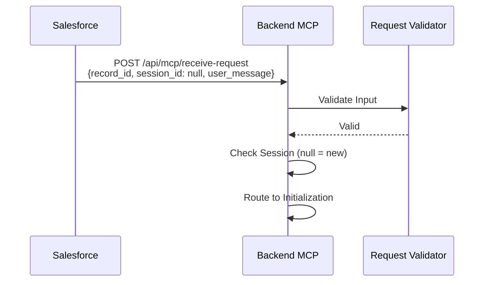

**Input** :
```json
{
  "record_id": "001XX000001",
  "session_id": null,
  "user_message": "Remplis tous les champs manquants"
}
```

### 2. Récupération des Données Salesforce

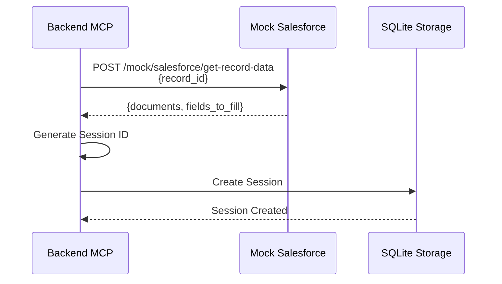

**Output de Mock Salesforce** :
```json
{
  "status": "success",
  "data": {
    "record_id": "001XX000001",
    "record_type": "Claim",
    "documents": [
      {
        "document_id": "doc_123",
        "name": "facture.pdf",
        "url": "https://...",
        "type": "application/pdf",
        "indexed": true
      }
    ],
    "fields_to_fill": [
      {
        "label": "Evènement déclencheur de sinistre",
        "apiName": null,
        "type": "picklist",
        "required": true,
        "possibleValues": ["Accident", "Assistance", "Bris de glace"],
        "defaultValue": "Accident"
      }
    ]
  }
}
```

### 3. Preprocessing

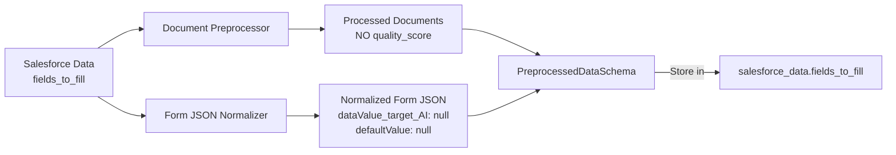

**Étapes** :
1. **Document Preprocessing** :
   - Validation des documents
   - Extraction des métadonnées
   - **NO quality_score** (removed)
   - Préparation pour OCR

2. **Form JSON Normalization** :
   - Normalise `fields_to_fill`
   - Ajoute `dataValue_target_AI: null` si absent
   - Force `defaultValue: null` pour tous les champs
   - Préserve tous les autres champs (label, type, possibleValues, etc.)
   - Reconstruit `SalesforceDataResponseSchema` avec champs normalisés
   - Stocke dans `PreprocessedDataSchema.salesforce_data.fields_to_fill`

3. **Context Summary** :
   - Résumé du contexte métier
   - Règles de validation
   - Objectif d'extraction

**Structure Résultante** :
```python
PreprocessedDataSchema(
    record_id="001XX000001",
    record_type="Claim",
    processed_documents=[...],
    salesforce_data=SalesforceDataResponseSchema(
        record_id="001XX000001",
        record_type="Claim",
        documents=[...],
        fields_to_fill=[  # Normalized fields
            {
                "label": "Evènement déclencheur de sinistre",
                "type": "picklist",
                "possibleValues": [...],
                "defaultValue": null,
                "dataValue_target_AI": null
            }
        ]
    ),
    context_summary=...,
    validation_results=...,
    metrics=...
)
```

### 4. Prompt Building

```mermaid
flowchart TD
    A[PreprocessedDataSchema] --> B[Extract salesforce_data]
    B --> C[Extract fields_to_fill]
    C --> D[Normalize Form JSON<br/>Ensure consistency]
    D --> E[Convert to JSON String]
    E --> F[Prompt Template Engine]
    F --> G{Scenario Type}
    G -->|Initialization| H[Initialization Template<br/>{{ form_json }}]
    G -->|Continuation| I[Continuation Template]
    H --> J[Prompt Builder]
    I --> J
    J --> K[Final Prompt<br/>with form_json embedded]
```

**Types de prompts** :
- **Initialization** : Première extraction complète
- **Extraction** : Extraction de champs spécifiques
- **Clarification** : Demande de précision
- **Validation** : Vérification des données
- **Continuation** : Suite de conversation

**Template Example** :
```jinja2
# Contexte
Type de record: {{ record_type }}
Objectif: {{ objective }}

# Documents disponibles

- {{ doc.name }} ({{ doc.type }})


# Form Fields (JSON)
{{ form_json }}

# Requête utilisateur
{{ user_request }}

# Instructions
{{ instructions }}
```

### 5. Prompt Optimization

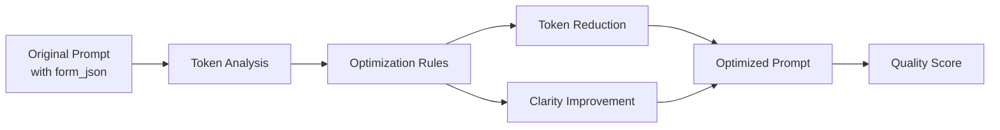

**Optimisations appliquées** :
- Réduction de tokens
- Amélioration de la clarté
- Structuration optimale
- Estimation des coûts

### 6. MCP Formatting & Sending

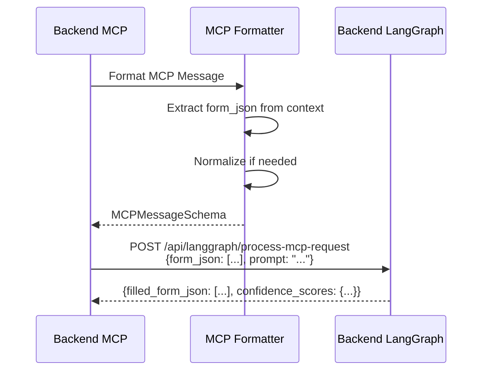

**MCP Message Structure** :
```json
{
  "message_id": "msg-...",
  "prompt": "Optimized prompt with form_json embedded...",
  "context": {
    "documents": [...],
    "form_json": [
      {
        "label": "...",
        "type": "picklist",
        "possibleValues": [...],
        "defaultValue": null,
        "dataValue_target_AI": null
      }
    ],
    "session_id": "..."
  },
  "metadata": {
    "record_id": "...",
    "record_type": "Claim",
    "timestamp": "..."
  }
}
```

**Langgraph Request** :
```json
{
  "record_id": "001XX000001",
  "session_id": "...",
  "user_request": "Full prompt text...",
  "documents": [
    {
      "id": "doc_123",
      "type": "application/pdf",
      "pages": [
        {
          "page_number": 1,
          "image_b64": "base64...",
          "image_mime": "application/pdf"
        }
      ]
    }
  ],
  "form_json": [
    {
      "label": "Evènement déclencheur de sinistre",
      "type": "picklist",
      "possibleValues": ["Accident", "Assistance", "Bris de glace"],
      "defaultValue": null,
      "dataValue_target_AI": null
    }
  ]
}
```

### 7. LangGraph Processing

```mermaid
flowchart TD
    A[MCP Request<br/>form_json] --> B[Initialize State<br/>MCPAgentState.form_json]
    B --> C[OCR Manager]
    C --> D[OCR Processing]
    D --> E[Text Blocks Extraction]
    E --> F[Mapping Manager]
    F --> G[Field Mapping<br/>Fill dataValue_target_AI]
    G --> H[Apply Golden Rule<br/>"non disponible" if not found]
    H --> I[Return filled_form_json<br/>Same structure]
    I --> J[Response Formatting]
    J --> K[Return to MCP]
```

**Étapes LangGraph** :
1. **State Initialization** : Stocke `form_json` dans `MCPAgentState`
2. **OCR Processing** : Extraction de texte depuis images
3. **Text Blocks** : Détection de blocs structurés
4. **Field Mapping** : 
   - Reçoit `form_json: List[Dict]`
   - Pour chaque champ, remplit `dataValue_target_AI` depuis OCR
   - Applique la Règle d'Or : `"non disponible"` si non trouvé
   - Ajoute `confidence` (0.0-1.0)
5. **Response** : Retourne `filled_form_json` avec même structure

**Mapping Manager Prompt (Golden Rule)** :
```
TON OBJECTIF PRINCIPAL: Remplir le champ 'dataValue_target_AI' pour chaque champ.

RÈGLE D'OR (GOLDEN RULE):
⚠️ Si tu ne trouves PAS l'information dans le texte OCR,
   tu DOIS mettre "non disponible" dans 'dataValue_target_AI'.
   Ne mets JAMAIS null, mets TOUJOURS "non disponible" si l'information n'est pas trouvée.
```

**Langgraph Response** :
```json
{
  "status": "success",
  "data": {
    "filled_form_json": [
      {
        "label": "Evènement déclencheur de sinistre",
        "type": "picklist",
        "required": true,
        "possibleValues": ["Accident", "Assistance", "Bris de glace"],
        "defaultValue": null,
        "dataValue_target_AI": "Accident",
        "confidence": 0.98
      }
    ],
    "confidence_scores": {
      "Evènement déclencheur de sinistre": 0.98
    },
    "processing_time": 2.5,
    "ocr_text_length": 5000,
    "text_blocks_count": 25,
    "metrics": {...}
  }
}
```

### 8. Response Handling

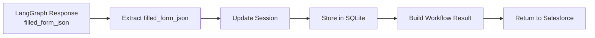

**Workflow Result Structure** :
```json
{
  "status": "completed",
  "workflow_id": "...",
  "data": {
    "response_handling": {
      "filled_form_json": [
        {
          "label": "Evènement déclencheur de sinistre",
          "dataValue_target_AI": "Accident",
          "confidence": 0.98
        }
      ],
      "confidence_scores": {...},
      "final_status": "success"
    }
  },
  "filled_form_json": [...],  // At root level for easy access
  "errors": [],
  "started_at": "2024-01-15T10:30:00Z",
  "completed_at": "2024-01-15T10:30:45Z"
}
```

## Flux Détaillé : Continuation

### 1. Réception de la Requête (Session Existante)

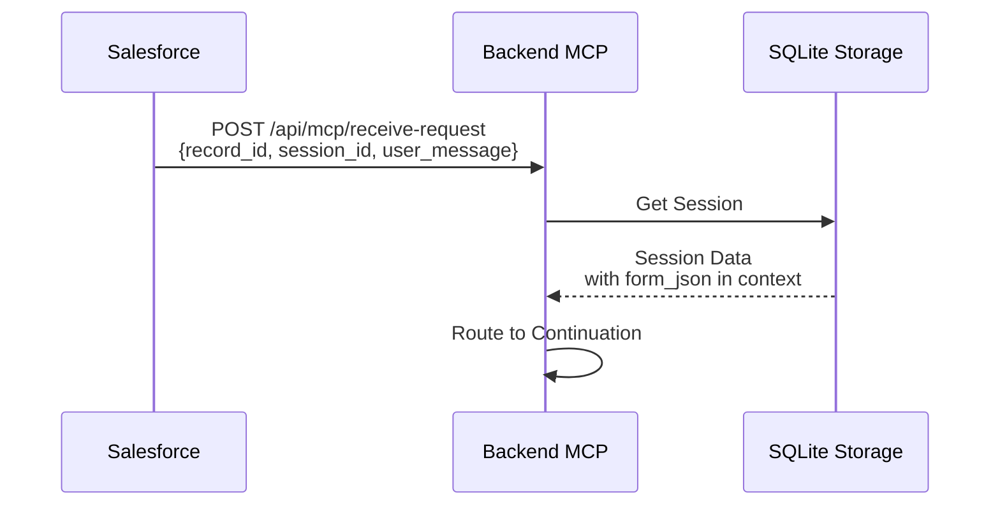

**Input** :
```json
{
  "record_id": "001XX000001",
  "session_id": "session-550e8400-...",
  "user_message": "Quel est le montant sur la facture ?"
}
```

### 2. Continuation Flow

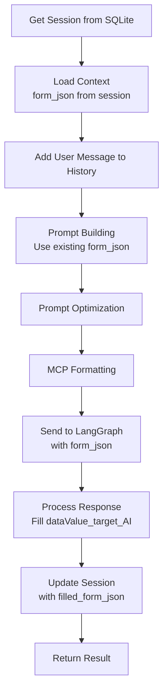

**Différences avec Initialization** :
- Pas de récupération Salesforce data
- Utilisation du contexte de session (form_json déjà normalisé)
- Ajout à l'historique de conversation
- Prompt de type "continuation" ou "clarification"

## Workflow Orchestrator - Étapes Complètes

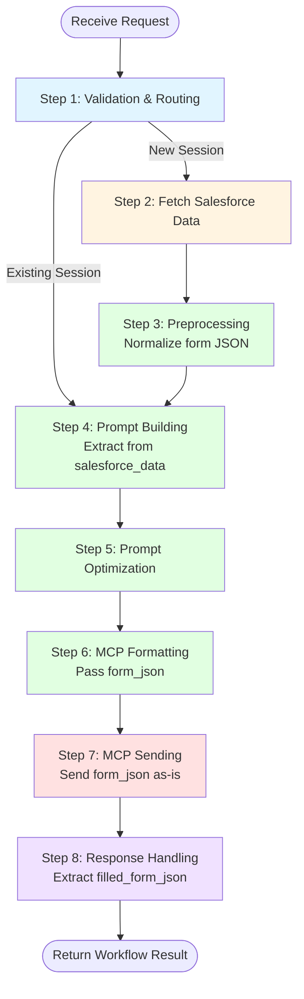

### Détails des Étapes

#### Step 1: Validation & Routing
- Validation des inputs
- Vérification de la session
- Routage vers Initialization ou Continuation

#### Step 2: Fetch Salesforce Data (Initialization uniquement)
- Appel à Mock Salesforce
- Récupération documents + `fields_to_fill` (format original)
- Création de session

#### Step 3: Preprocessing
- **Document Processing** : Traitement des documents (sans quality_score)
- **Form JSON Normalization** :
  - Normalise `fields_to_fill`
  - Ajoute `dataValue_target_AI: null`
  - Force `defaultValue: null`
  - Reconstruit `SalesforceDataResponseSchema`
  - Stocke dans `PreprocessedDataSchema.salesforce_data.fields_to_fill`
- **Context Summary** : Génération du contexte

#### Step 4: Prompt Building
- Extraction de `preprocessed_data.salesforce_data.fields_to_fill`
- Normalisation (vérification de cohérence)
- Conversion en JSON string
- Intégration dans le prompt comme variable `form_json`
- Sélection du template selon le scénario

#### Step 5: Prompt Optimization
- Analyse des tokens
- Optimisation
- Calcul du score de qualité

#### Step 6: MCP Formatting
- Formatage du message MCP
- Extraction de `form_json` depuis le contexte
- Normalisation si nécessaire
- Passage dans `MCPMessageSchema.context.form_json`

#### Step 7: MCP Sending
- Conversion du message MCP au format Langgraph
- Envoi de `form_json` **tel quel** (pas de conversion)
- Attente de la réponse
- Gestion des erreurs

#### Step 8: Response Handling
- Extraction de `filled_form_json` depuis la réponse Langgraph
- Mise à jour de la session
- Construction du résultat final avec `filled_form_json` à la racine

## Format des Données - Input/Output

### Input Format (Salesforce → Mock Salesforce)

```json
{
  "record_id": "001XX000001"
}
```

### Output Format (Mock Salesforce → Backend MCP)

```json
{
  "status": "success",
  "data": {
    "record_id": "001XX000001",
    "record_type": "Claim",
    "documents": [
      {
        "document_id": "doc_123",
        "name": "facture.pdf",
        "url": "https://...",
        "type": "application/pdf",
        "indexed": true
      }
    ],
    "fields_to_fill": [
      {
        "label": "Evènement déclencheur de sinistre",
        "apiName": null,
        "type": "picklist",
        "required": true,
        "possibleValues": ["Accident", "Assistance", "Bris de glace"],
        "defaultValue": "Accident"
      }
    ]
  }
}
```

### Normalized Format (After Preprocessing)

```json
{
  "record_id": "001XX000001",
  "record_type": "Claim",
  "processed_documents": [
    {
      "document_id": "doc_123",
      "name": "facture.pdf",
      "url": "https://...",
      "type": "application/pdf",
      "indexed": true,
      "metadata": {...},
      "processed": true
    }
  ],
  "salesforce_data": {
    "record_id": "001XX000001",
    "record_type": "Claim",
    "documents": [...],
    "fields_to_fill": [
      {
        "label": "Evènement déclencheur de sinistre",
        "apiName": null,
        "type": "picklist",
        "required": true,
        "possibleValues": ["Accident", "Assistance", "Bris de glace"],
        "defaultValue": null,
        "dataValue_target_AI": null
      }
    ]
  },
  "context_summary": {...},
  "validation_results": {...},
  "metrics": {...}
}
```

### Output Format (Backend MCP → Salesforce)

```json
{
  "status": "completed",
  "workflow_id": "uuid",
  "filled_form_json": [
    {
      "label": "Evènement déclencheur de sinistre",
      "apiName": null,
      "type": "picklist",
      "required": true,
      "possibleValues": ["Accident", "Assistance", "Bris de glace"],
      "defaultValue": null,
      "dataValue_target_AI": "Accident",
      "confidence": 0.98
    }
  ],
  "confidence_scores": {
    "Evènement déclencheur de sinistre": 0.98
  },
  "data": {
    "response_handling": {
      "filled_form_json": [...],
      "confidence_scores": {...},
      "final_status": "success"
    }
  },
  "errors": [],
  "started_at": "2024-01-15T10:30:00Z",
  "completed_at": "2024-01-15T10:30:45Z"
}
```

## Gestion des Erreurs

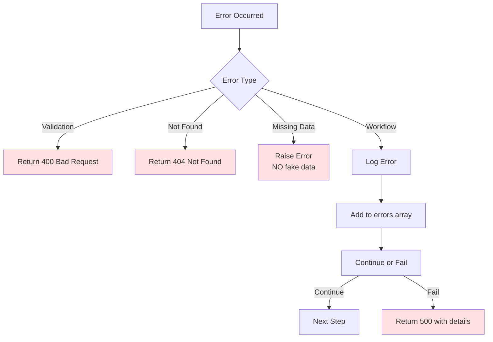

**Stratégie d'erreur** :
- Erreurs de validation : Arrêt immédiat (400)
- Données manquantes : **Raise Error** (pas de fake data)
- Erreurs de workflow : Log + Ajout à `errors` array
- Erreurs critiques : Arrêt du workflow (500)
- Erreurs non-critiques : Continuation avec warning

## Logging et Monitoring

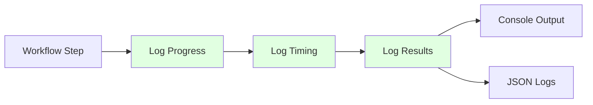

**Types de logs** :
- **Progress** : `[PROGRESS 1/8] Starting Validation & Routing`
- **Timing** : `[TIMING] Step 1 completed (took 0.45s)`
- **Results** : Données extraites, scores de confiance, form_json structure
- **Errors** : Détails des erreurs avec contexte

## Performance et Optimisations

### Temps d'Exécution Typiques

| Étape | Temps Moyen | Description |
|-------|-------------|-------------|
| Validation & Routing | 0.1s | Validation rapide |
| Fetch Salesforce Data | 0.2s | Appel HTTP |
| Preprocessing | 1.0s | Traitement documents + normalisation form JSON |
| Prompt Building | 0.5s | Construction du prompt avec form_json |
| Prompt Optimization | 0.3s | Optimisation |
| MCP Formatting | 0.1s | Formatage avec form_json |
| MCP Sending | 10-30s | Traitement LangGraph (OCR + Extraction) |
| Response Handling | 0.2s | Mise à jour session |
| **Total** | **12-32s** | Workflow complet |

### Optimisations

1. **Caching** : Sessions SQLite pour éviter re-fetch Salesforce
2. **Async Processing** : Tâches asynchrones pour longues opérations
3. **Prompt Optimization** : Réduction des tokens pour coûts
4. **Form JSON As-Is** : Pas de transformation complexe, préservation des données

## Exemples de Flux Complets

### Exemple 1 : Nouvelle Session - Extraction Complète

```
1. Salesforce → MCP : {record_id: "001XX000001", session_id: null, user_message: "Remplis tous les champs"}
2. MCP → Mock SF : Get record data
3. Mock SF → MCP : Documents + fields_to_fill (original format)
4. MCP : Preprocessing
   - Normalize form JSON (add dataValue_target_AI: null, defaultValue: null)
   - Store in preprocessed_data.salesforce_data.fields_to_fill
5. MCP : Prompt Building
   - Extract from preprocessed_data.salesforce_data.fields_to_fill
   - Embed as form_json in prompt
6. MCP : Prompt Optimization
7. MCP → LangGraph : {form_json: [...], prompt: "..."}
8. LangGraph : OCR + Mapping
   - Fill dataValue_target_AI for each field
   - Apply Golden Rule: "non disponible" if not found
9. LangGraph → MCP : {filled_form_json: [...]}
10. MCP : Update Session
11. MCP → Salesforce : {filled_form_json: [...], status: "completed"}
```

### Exemple 2 : Session Continue - Clarification

```
1. Salesforce → MCP : {record_id: "001XX000001", session_id: "session-...", user_message: "Quel est le montant ?"}
2. MCP : Get Session from SQLite (form_json already normalized)
3. MCP : Prompt Building (Continuation)
   - Use form_json from session context
4. MCP : Prompt Optimization
5. MCP → LangGraph : {form_json: [...], prompt: "..."}
6. LangGraph : Process with context
   - Fill dataValue_target_AI for requested fields
7. LangGraph → MCP : {filled_form_json: [...]}
8. MCP : Update Session
9. MCP → Salesforce : {filled_form_json: [...], status: "completed"}
```

## Points Clés de l'Architecture

### 1. Form JSON As-Is
- Les champs sont envoyés **tels quels** à travers le pipeline
- Seule normalisation : `dataValue_target_AI: null` et `defaultValue: null`
- Toutes les autres informations préservées (label, type, possibleValues, etc.)

### 2. Structure Nested
- `PreprocessedDataSchema.salesforce_data.fields_to_fill` contient les champs normalisés
- Accès : `preprocessed_data.salesforce_data.fields_to_fill`

### 3. Golden Rule
- Si information non trouvée dans OCR → `"non disponible"`
- Jamais `null` ou chaîne vide
- OCR est la référence unique

### 4. Même Structure Input/Output
- Input : `form_json` avec `dataValue_target_AI: null`
- Output : `filled_form_json` avec `dataValue_target_AI` rempli
- Structure identique, seulement les valeurs changent
