# Flux du Pipeline OptiClaims

Documentation visuelle et détaillée du flux de données dans le pipeline OptiClaims.

## Vue d'Ensemble

Le pipeline OptiClaims traite les requêtes Salesforce pour extraire automatiquement des données depuis des documents en utilisant l'IA générative.

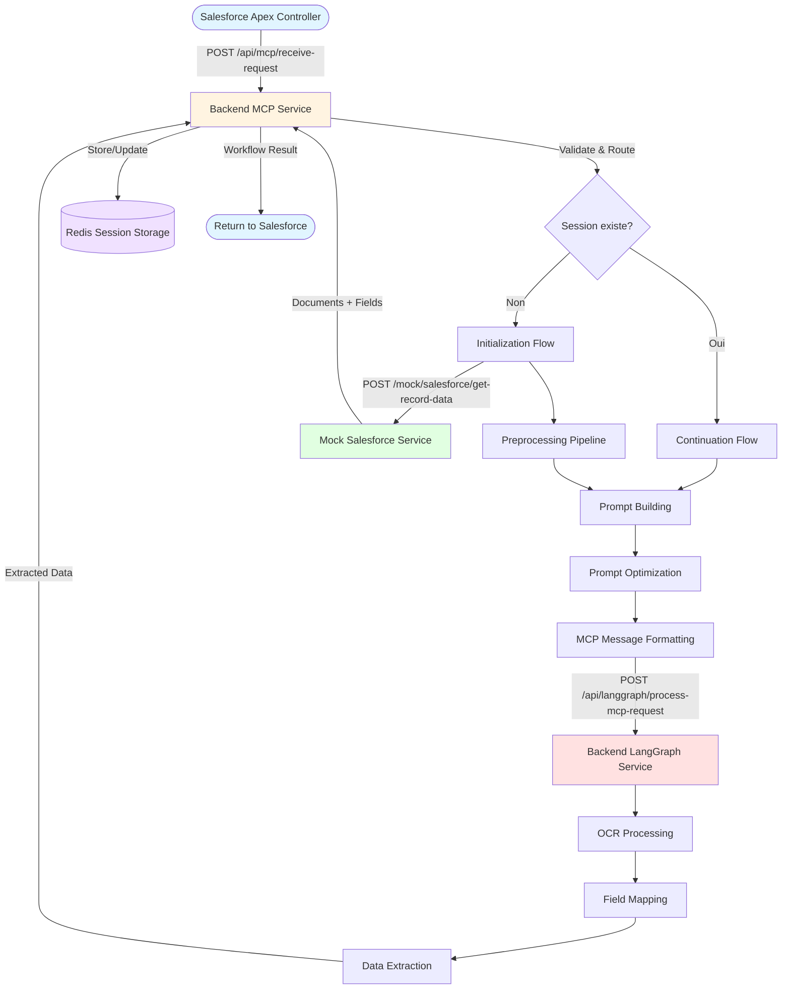

## Flux Détaillé : Initialization

### 1. Réception de la Requête

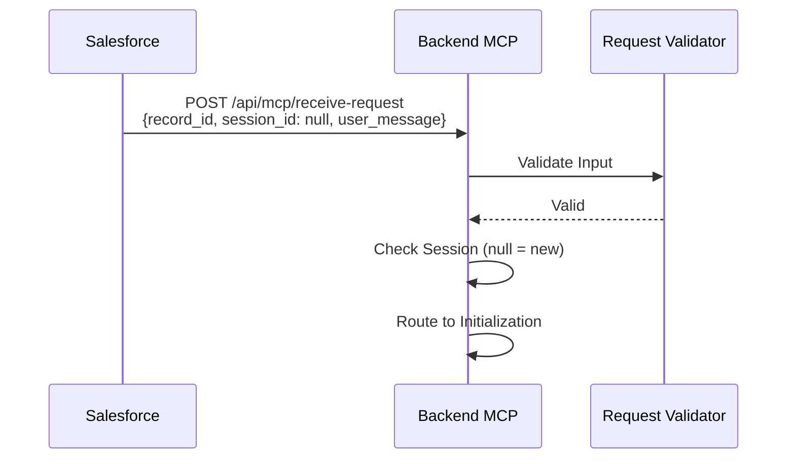

**Input** :
```json
{
  "record_id": "001XX000001",
  "session_id": null,
  "user_message": "Remplis tous les champs manquants"
}
```

### 2. Récupération des Données Salesforce

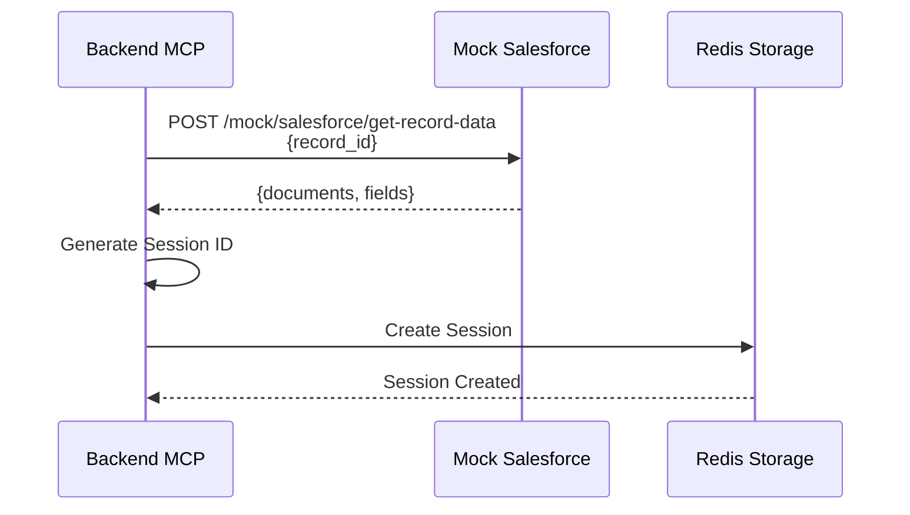

**Output de Mock Salesforce** :
```json
{
  "status": "success",
  "data": {
    "record_id": "001XX000001",
    "record_type": "Claim",
    "documents": [...],
    "fields": [...]
  }
}
```

### 3. Preprocessing

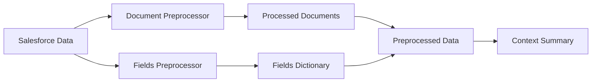

**Étapes** :
1. **Document Preprocessing** :
   - Validation des documents
   - Extraction des métadonnées
   - Calcul du score de qualité
   - Préparation pour OCR

2. **Fields Preprocessing** :
   - Enrichissement des champs
   - Classification (vide/prérempli)
   - Priorisation
   - Génération du dictionnaire

3. **Context Summary** :
   - Résumé du contexte métier
   - Règles de validation
   - Objectif d'extraction

### 4. Prompt Building

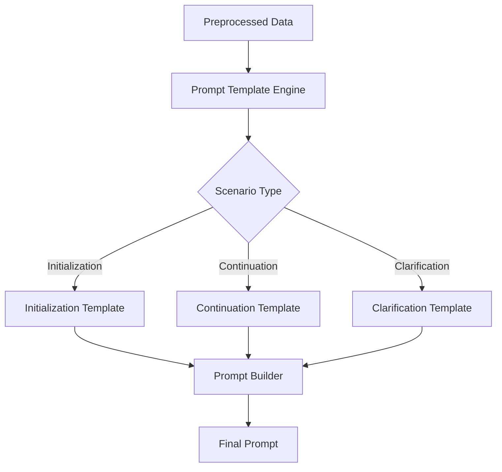

**Types de prompts** :
- **Initialization** : Première extraction complète
- **Extraction** : Extraction de champs spécifiques
- **Clarification** : Demande de précision
- **Validation** : Vérification des données
- **Continuation** : Suite de conversation

### 5. Prompt Optimization

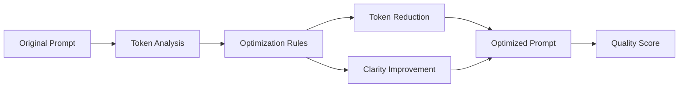

**Optimisations appliquées** :
- Réduction de tokens
- Amélioration de la clarté
- Structuration optimale
- Estimation des coûts

### 6. MCP Formatting & Sending

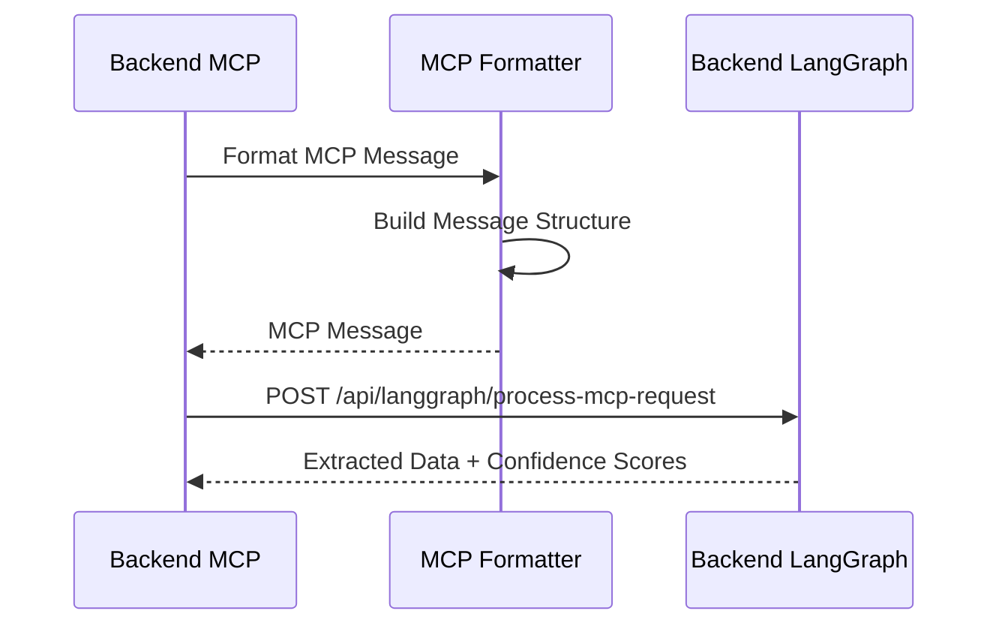

**MCP Message Structure** :
```json
{
  "message_id": "msg-...",
  "prompt": "Optimized prompt...",
  "context": {
    "documents": [...],
    "fields": [...],
    "session_id": "..."
  },
  "metadata": {
    "record_id": "...",
    "record_type": "Claim",
    "timestamp": "..."
  }
}
```

### 7. LangGraph Processing

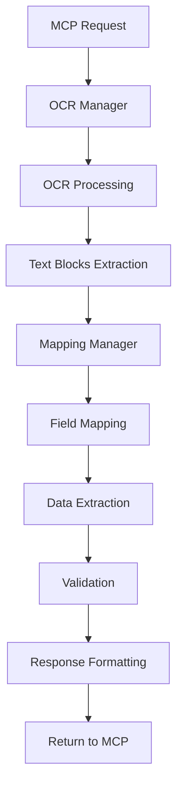

**Étapes LangGraph** :
1. **OCR Processing** : Extraction de texte depuis images
2. **Text Blocks** : Détection de blocs structurés
3. **Field Mapping** : Association champs → texte
4. **Data Extraction** : Extraction des valeurs
5. **Validation** : Vérification de la qualité
6. **Response** : Formatage de la réponse

### 8. Response Handling

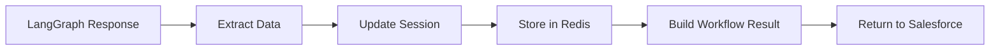

**Workflow Result Structure** :
```json
{
  "status": "completed",
  "workflow_id": "...",
  "data": {
    "response_handling": {
      "extracted_data": {...},
      "confidence_scores": {...},
      "final_status": "success"
    }
  }
}
```

## Flux Détaillé : Continuation

### 1. Réception de la Requête (Session Existante)

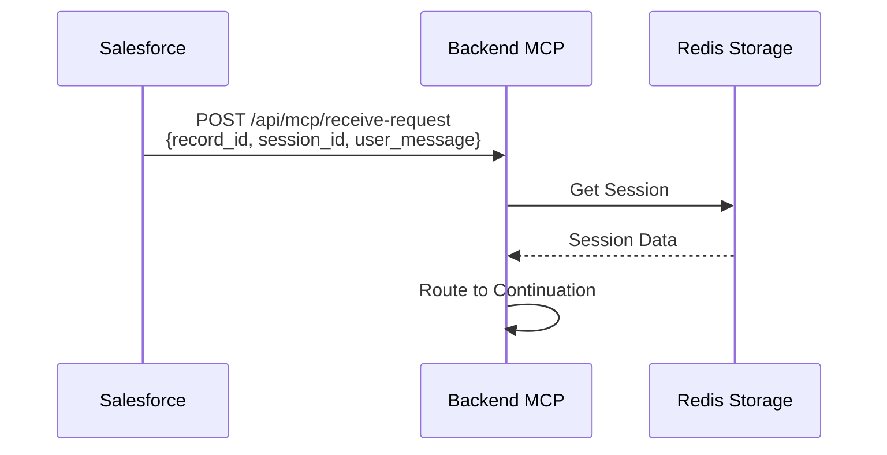

**Input** :
```json
{
  "record_id": "001XX000001",
  "session_id": "session-550e8400-...",
  "user_message": "Quel est le montant sur la facture ?"
}
```

### 2. Continuation Flow

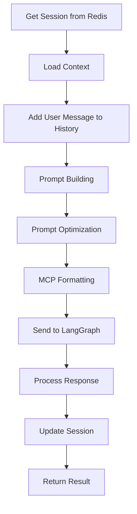

**Différences avec Initialization** :
- Pas de récupération Salesforce data
- Utilisation du contexte de session
- Ajout à l'historique de conversation
- Prompt de type "continuation" ou "clarification"

## Workflow Orchestrator - Étapes Complètes

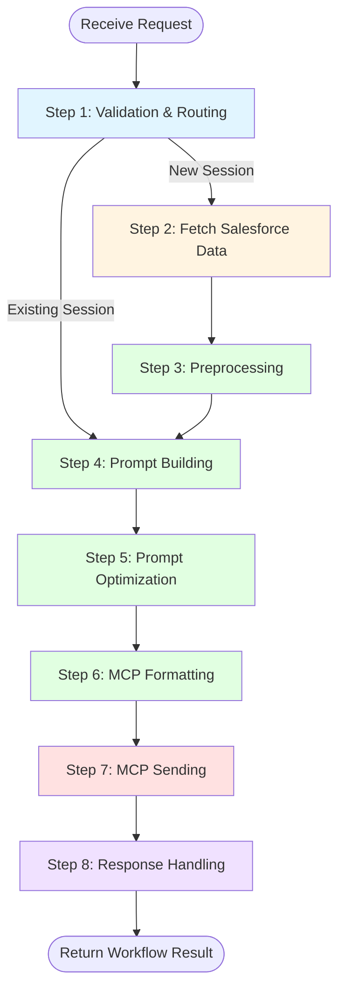

### Détails des Étapes

#### Step 1: Validation & Routing
- Validation des inputs
- Vérification de la session
- Routage vers Initialization ou Continuation

#### Step 2: Fetch Salesforce Data (Initialization uniquement)
- Appel à Mock Salesforce
- Récupération documents + champs
- Création de session

#### Step 3: Preprocessing
- Preprocessing des documents
- Preprocessing des champs
- Génération du contexte

#### Step 4: Prompt Building
- Sélection du template
- Construction du prompt
- Ajout du contexte

#### Step 5: Prompt Optimization
- Analyse des tokens
- Optimisation
- Calcul du score de qualité

#### Step 6: MCP Formatting
- Formatage du message MCP
- Ajout des métadonnées
- Génération du message_id

#### Step 7: MCP Sending
- Envoi à Backend LangGraph
- Attente de la réponse
- Gestion des erreurs

#### Step 8: Response Handling
- Extraction des données
- Mise à jour de la session
- Construction du résultat final

## Gestion des Erreurs

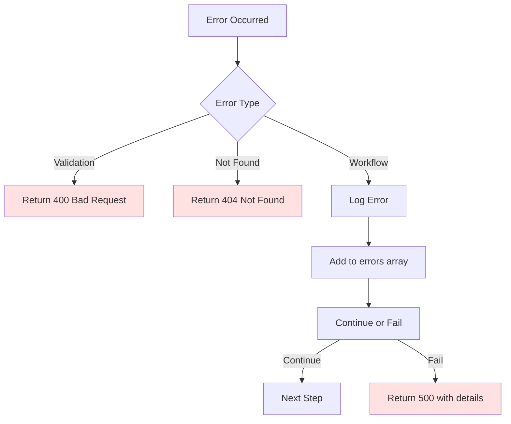

**Stratégie d'erreur** :
- Erreurs de validation : Arrêt immédiat (400)
- Erreurs de workflow : Log + Ajout à `errors` array
- Erreurs critiques : Arrêt du workflow (500)
- Erreurs non-critiques : Continuation avec warning

## Logging et Monitoring

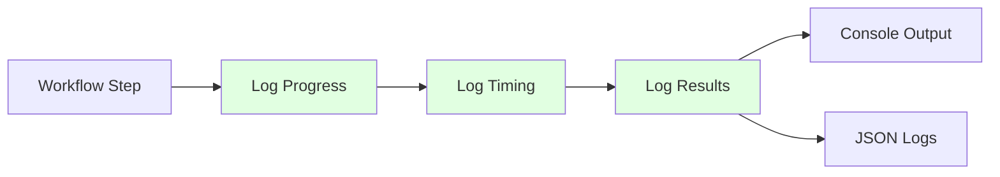

**Types de logs** :
- **Progress** : `[PROGRESS 1/7] Starting Validation & Routing`
- **Timing** : `[TIMING] Step 1 completed (took 0.45s)`
- **Results** : Données extraites, scores de confiance
- **Errors** : Détails des erreurs avec contexte

## Performance et Optimisations

### Temps d'Exécution Typiques

| Étape | Temps Moyen | Description |
|-------|-------------|-------------|
| Validation & Routing | 0.1s | Validation rapide |
| Fetch Salesforce Data | 0.2s | Appel HTTP |
| Preprocessing | 1.0s | Traitement documents + champs |
| Prompt Building | 0.5s | Construction du prompt |
| Prompt Optimization | 0.3s | Optimisation |
| MCP Formatting | 0.1s | Formatage |
| MCP Sending | 10-30s | Traitement LangGraph (OCR + Extraction) |
| Response Handling | 0.2s | Mise à jour session |
| **Total** | **12-32s** | Workflow complet |

### Optimisations

1. **Caching** : Sessions Redis pour éviter re-fetch Salesforce
2. **Async Processing** : Tâches asynchrones pour longues opérations
3. **Prompt Optimization** : Réduction des tokens pour coûts
4. **Parallel Processing** : Traitement parallèle des documents (futur)

## Exemples de Flux Complets

### Exemple 1 : Nouvelle Session - Extraction Complète

```
1. Salesforce → MCP : {record_id: "001XX000001", session_id: null, user_message: "Remplis tous les champs"}
2. MCP → Mock SF : Get record data
3. Mock SF → MCP : Documents + Fields
4. MCP : Preprocessing
5. MCP : Prompt Building (Initialization)
6. MCP : Prompt Optimization
7. MCP → LangGraph : MCP Message
8. LangGraph : OCR + Extraction
9. LangGraph → MCP : Extracted Data
10. MCP : Update Session
11. MCP → Salesforce : Workflow Result
```

### Exemple 2 : Session Continue - Clarification

```
1. Salesforce → MCP : {record_id: "001XX000001", session_id: "session-...", user_message: "Quel est le montant ?"}
2. MCP : Get Session from Redis
3. MCP : Prompt Building (Continuation)
4. MCP : Prompt Optimization
5. MCP → LangGraph : MCP Message
6. LangGraph : Process with context
7. LangGraph → MCP : Response
8. MCP : Update Session
9. MCP → Salesforce : Workflow Result
```

